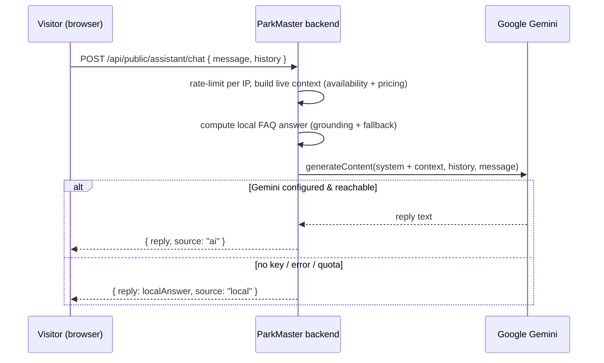

# AI Chat Assistant

A public chat assistant available on every page (landing → login → app). It answers
visitor questions about parking availability, pricing, reservations, monthly passes, and
how to use the app. **Hybrid design**: a built-in local FAQ always works, and when a free
Google Gemini key is configured the backend produces richer answers grounded in the same
live parking data.

## Why it matters

- Guides guests before they sign up, so it runs with no authentication.
- **Never breaks the demo**: with no API key, a network failure, or quota exhaustion, it
  falls back to local FAQ answers built from real availability and pricing.
- The API key stays server-side — the browser never sees it.
- A real LLM integration (system instruction, conversation history, live-data grounding)
  with no extra dependency: it uses the built-in JDK `HttpClient`.

## Actors & flow

The response field `source` (`"ai"` vs `"local"`) shows which path served each reply —
handy to point out during the demo.

## Backend (`com.parkmaster.assistant`)

| Class | Role |
| --- | --- |
| `AssistantController` | `POST /api/public/assistant/chat`, no auth, per-IP rate limit. |
| `AssistantService` | Builds live context, computes local FAQ answer, calls Gemini, picks AI reply or local fallback. |
| `GeminiClient` | JDK `HttpClient` wrapper over Gemini; any failure/missing key → empty → fallback. |
| `AssistantDtos` | `ChatRequest` (validated), `Turn`, `ChatResponse {reply, source}`. |

## Frontend

- `components/AiAssistant.jsx` — floating chat widget (toggle, suggestions, history,
  typing indicator), mounted once in `App.jsx` so it appears on every route.
- Styled with the app's "Control Room" design tokens and shared `Button` — matches the
  rest of the app and is automatically dark-mode aware.

## Safeguards (talking points)

- **No PII**: only public availability and pricing are sent to the model.
- **Grounding**: the model is told not to invent buildings or prices outside the live data.
- **Rate limiting** per IP protects the free quota and limits abuse.
- **Input validation**: message required and length-capped; history trimmed to recent turns.
- **Graceful degradation**: AI is an enhancement layer over an always-on local assistant.

## Configuration (one line)

Optional. Set `GEMINI_API_KEY` to enable Gemini answers; with no key the assistant runs
in local FAQ mode. Setup and deployment steps live in the project README, not here.
