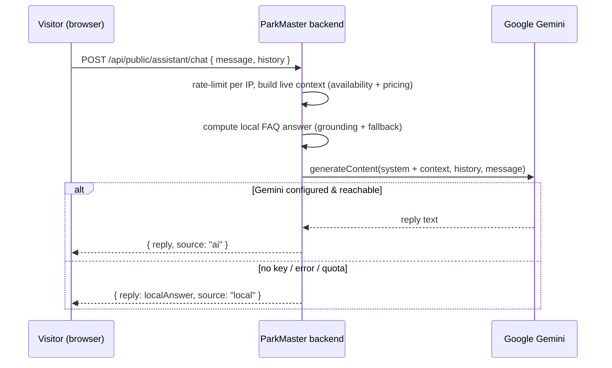

# AI Chat Assistant

A public chat assistant available on every page (landing → login → app). It answers
questions about parking availability, pricing, reservations, monthly passes, and how to
use the app. **Hybrid design**: a built-in local FAQ always works, and when a free
Google Gemini key is configured the backend produces richer, grounded answers using the
same live parking data as context.

## Why it matters

- Guides guests before they sign up (SEO + conversion), so it must run with no auth.
- **Never breaks the demo**: with no API key, network failure, or quota exhaustion, it
  falls back to local FAQ answers built from real availability and pricing data.
- The API key stays server-side — the browser never sees it.
- Demonstrates a real LLM integration (system instruction, conversation history, live
  context grounding) without adding a single dependency (JDK `HttpClient`).

## Actors & flow



## Backend (`com.parkmaster.assistant`)

| File | Role |
| --- | --- |
| `AssistantController` | `POST /api/public/assistant/chat`, no auth, per-IP rate limit (15/min, in-memory). |
| `AssistantService` | Builds live context, computes local FAQ answer, calls Gemini, picks AI reply or local fallback. |
| `GeminiClient` | JDK `HttpClient` wrapper over Gemini `generateContent`. Any failure/missing key → empty → fallback. |
| `AssistantDtos` | `ChatRequest` (validated: non-blank, ≤1000 chars), `Turn`, `ChatResponse {reply, source}`. |

Response envelope: `source` is `"ai"` when Gemini answered, `"local"` when the FAQ did —
useful to show in the demo which path served the reply.

## Frontend

- `components/AiAssistant.jsx` — floating chat widget (toggle button, suggestions, message
  history, typing indicator).
- Mounted once in `App.jsx` inside `BrowserRouter`, so it appears on every route.
- `lib/endpoints.js` → `publicApi.assistantChat(message, history)`.

## Adding / configuring the AI API key

The assistant works out of the box in **local FAQ mode** with no configuration. To enable
real Gemini answers:

1. Get a free key at <https://aistudio.google.com/apikey>.
2. Set the environment variable before starting the backend:

   ```bash
   export GEMINI_API_KEY=your_key_here
   # optional, defaults to gemini-2.0-flash
   export GEMINI_MODEL=gemini-2.0-flash
   ```

   Local run:

   ```bash
   cd backend && GEMINI_API_KEY=your_key_here mvnd spring-boot:run
   ```

3. Deploy (Render): add `GEMINI_API_KEY` (and optionally `GEMINI_MODEL`) as a service
   environment variable.

Config binding (`application.yml`):

```yaml
parkmaster:
  gemini:
    api-key: ${GEMINI_API_KEY:}        # empty => local FAQ fallback
    model: ${GEMINI_MODEL:gemini-2.0-flash}
```

### Swapping providers

`GeminiClient` is the only Gemini-specific code. To switch to another free provider
(Groq, OpenRouter, Cloudflare Workers AI), replace the endpoint, request body shape, and
response-text extraction in that one class — `AssistantService` and the frontend are
provider-agnostic.

## Safeguards

- **Rate limiting**: 15 requests/min per IP (in-memory; single instance). Swap for
  Redis/bucket4j if scaled horizontally.
- **Input validation**: message required, capped at 1000 chars; history trimmed to the
  last 6 turns and normalized to start on a user turn (Gemini requirement).
- **No PII**: only public availability and pricing data are sent to the model.
- **Grounding**: the prompt instructs the model not to invent buildings or prices not in
  the supplied live data.
