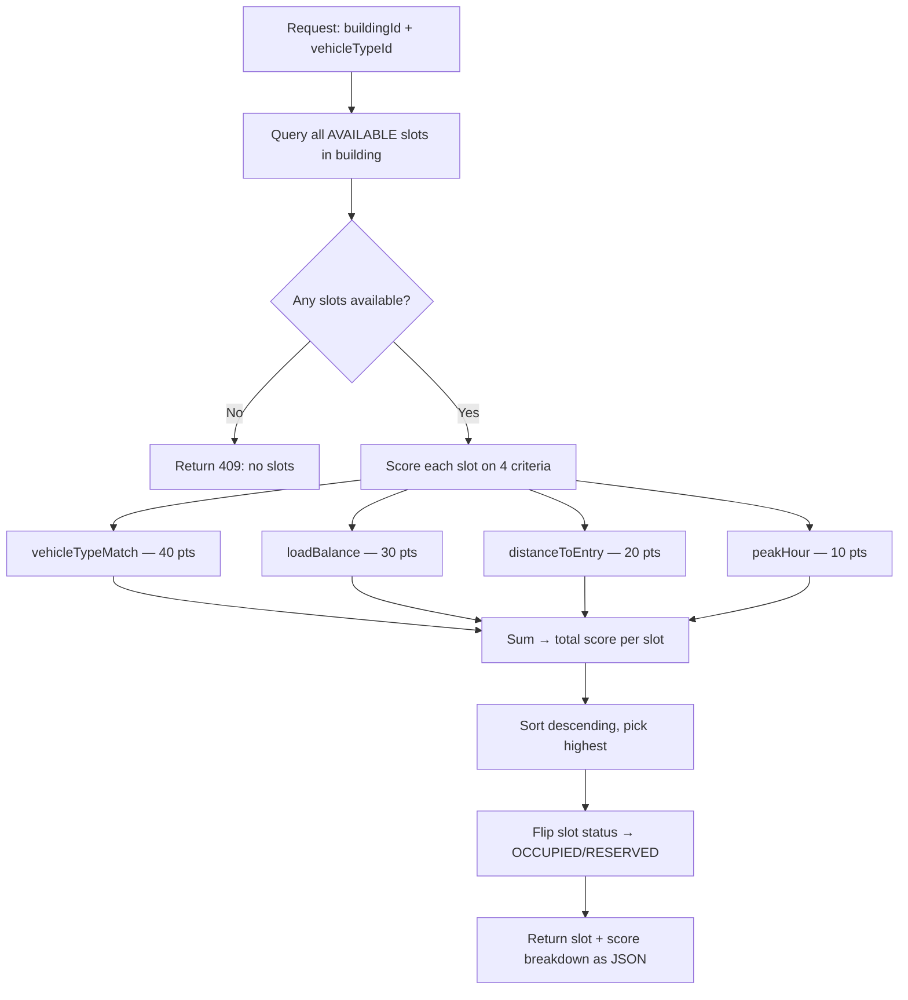

# AI Slot Allocation (Key Feature)

The priority feature for grading. Instead of staff hand-picking a slot, the system
scores every available slot and auto-assigns the best one. Directly answers the
research questions (RQ2–RQ4).

## Scoring Flow



## Scoring Model (`SlotAllocationService`)

| Criterion | Weight | What it measures |
|-----------|--------|------------------|
| `vehicleTypeMatch` | **40** | Floor assigned to the requested vehicle type → full score; unassigned floor → 50%; wrong-type floor → 0 |
| `loadBalance` | **30** | Slots with emptier floors score higher: `(1 − floorOccupancy%) × 30` |
| `distanceToEntry` | **20** | Lower floor number = closer to entry = higher score |
| `peakHour` | **10** | During peak hours (7–9 AM, 5–7 PM) the algorithm favours emptier floors more aggressively |

Total: **100 points** max per slot. The slot with the highest score wins. Ties
broken by lower slot ID (deterministic). The full score breakdown is stored as a
JSONB `allocation_score` field on the session/reservation for auditability.

## Where it Runs

- **Check-in** (`/api/staff/sessions/check-in`) — staff omit `slotId` → auto-allocate.
- **Reservation** (`/api/driver/reservations`) — driver pre-book picks + holds the best slot.

Both call `allocate(buildingId, vehicleTypeId)`. Concurrency: the allocate-then-flip
window is guarded by a re-check + retry-once, not a row lock — upgrade to
`SELECT ... FOR UPDATE` or `@Version` only if real contention shows up.

## Analytics

Fill-rate and session-duration metrics are exposed at:

```
GET /api/manager/buildings/{id}/analytics/allocation
```

Response includes: total slots, occupied count, fill rate (%), average session
duration, allocation method split (auto vs manual), and per-floor breakdown.

## Research Links

| RQ | Question | How allocation answers it |
|----|----------|--------------------------|
| **RQ2** | Does auto allocation reduce time-to-park vs free choice? | Compare auto-allocated session durations to manual ones. |
| **RQ3** | Which criteria matter most? | The weights (40/30/20/10) are tunable; analytics show which criterion correlates with faster turnover. |
| **RQ4** | Can the algorithm improve peak-hour utilization? | The `peakHour` factor redistributes load during rush hours; fill-rate analytics before/after measure impact. |

## Why Weighted Scoring (Not ML)

- **Explainable**: every score can be broken down and shown to the teacher —
  no black-box model to justify.
- **Deterministic**: same input → same output, which is essential for testing.
- **Tunable**: weights are constants, easy to adjust for experiments.
- **No training data needed**: the system works from day one with zero historical sessions.
- For a capstone project, this is the right trade-off between sophistication and
  demonstrability. ML is the natural next step when real usage data exists.

## Implementation Files

| Layer | File | Purpose |
|-------|------|---------|
| Service | `session/SlotAllocationService.java` | `allocate()`, `score()`, `vehicleTypeScore()`, `loadBalanceScore()`, `distanceScore()`, `peakScore()`, inner `ScoreBreakdown` record |
| Controller | `parking/PublicParkingController.java` | `GET /api/public/buildings/{id}/slots/available` (public availability) |
| Controller | `parking/StaffParkingController.java` | Check-in endpoint that calls allocator |
| Controller | `reservation/DriverReservationController.java` | `POST /api/driver/reservations/suggest` (AI slot suggestions for paid tier) |
| Entity | `parking/ParkingSlot.java` | `SlotStatus` enum, `allocationScore` JSONB field |
| Analytics | `report/ReportService.java` | `GET /api/manager/buildings/{id}/analytics/allocation` |
| Frontend | `components/AllocationShowcase.jsx` | Visual demo of scoring on landing page |
| Frontend | `components/ScoreBreakdownCard.jsx` | Per-criterion score bars (40/30/20/10) |
| Frontend | `pages/staff/CheckInPage.jsx` | Staff check-in triggers auto-allocation |
| Test | `session/SlotAllocationServiceTest.java` | Unit tests for scoring model |

## Slide Notes

- **One-liner**: "AI scores every available slot on four criteria and picks the best one — explainable, deterministic, tunable."
- **Demo flow**: Staff check-in → omit slot → backend auto-assigns → show score breakdown card on frontend.
- **Grading hook**: Directly answers RQ2, RQ3, RQ4. Weights are tunable constants for experiments.
- **Visual**: AllocationShowcase component on landing page has live score bars — screenshots work well in slides.
