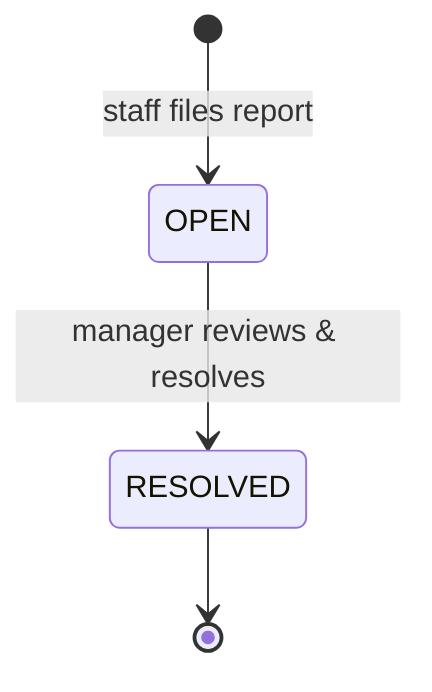

# Exception Reports

Handles parking incidents that standard check-in/check-out cannot cover. Staff file
reports; managers review and resolve them. Each exception type carries a penalty
surcharge applied to the final payment.

## Exception Types

| Type | When | Penalty |
|------|------|---------|
| `LOST_TICKET` | Driver cannot produce the parking ticket at exit | Fixed surcharge |
| `WRONG_PLATE` | License plate at exit does not match check-in record | Surcharge + manual verify |
| `OVERTIME` | Session exceeds the daily cap or expected duration | Extra hours charged |
| `WRONG_ZONE` | Vehicle parked in a zone designated for a different vehicle type | Zone violation fee |

## Lifecycle



1. **Staff files** — selects exception type, writes description, optionally links a
   parking session.
2. **Manager reviews** — sees all open reports, resolves with a resolution note.
3. **Payment impact** — the penalty amount is added to the session payment as
   `penalty_amount`; the total = base charge + penalty.

## Actors

| Role | Can do |
|------|--------|
| Staff | File a report (`POST /api/staff/exception-reports`) |
| Staff | View own reports |
| Manager | List all reports, filter by status (`GET /api/manager/exception-reports`) |
| Manager | Resolve a report (`PUT /api/manager/exception-reports/{id}/resolve`) |

## API

- `POST /api/staff/exception-reports` — body: `{ sessionId?, type, description }`
- `GET /api/staff/exception-reports` — staff's own reports
- `GET /api/manager/exception-reports?status=OPEN` — filterable list
- `PUT /api/manager/exception-reports/{id}/resolve` — body: `{ resolution }`

## Data Model

```
exception_report
├── id              PK
├── session_id      FK → parking_session (optional)
├── reported_by     FK → users (staff)
├── type            ENUM (LOST_TICKET | WRONG_PLATE | OVERTIME | WRONG_ZONE)
├── status          ENUM (OPEN | RESOLVED)
├── description     VARCHAR
├── resolution      VARCHAR (filled on resolve)
├── created_at      TIMESTAMPTZ
└── resolved_at     TIMESTAMPTZ
```

## Demo Data (seeder)

6 reports seeded: 3 OPEN + 3 RESOLVED across all 4 types, linked to different
sessions and drivers.

## Talking Points

- Every real parking building needs an exception workflow — it is not optional.
- Linking exceptions to sessions preserves an audit trail.
- Penalty surcharge flows through the existing payment pipeline (no separate
  billing path).
- Status is simple (OPEN → RESOLVED) because the physical resolution happens
  at the gate, not in software.
