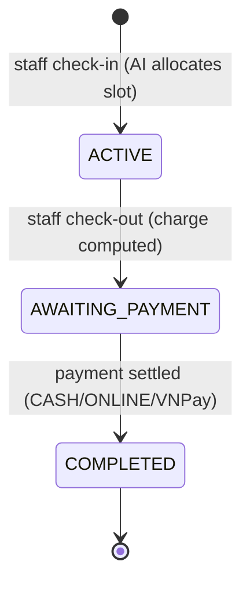

# Parking Session (Check-in / Check-out)

The core operational flow. Staff check in a vehicle — the AI allocator auto-assigns
the best slot (manual mode removed). On exit, the charge is computed and a payment
created. Each session gets a unique QR ticket for scan-to-checkout.

## Flow

1. **Check-in** — staff submits `{ buildingId, vehicleTypeId, licensePlate }`.
   The AI allocator scores all AVAILABLE slots and picks the best one.
   Slot → OCCUPIED, session created with a UUID `ticketCode` (QR-printable).
   Duplicate check-in guard: same plate already ACTIVE → 409.
2. **Check-out** — charge computed from the vehicle type's `PricingPolicy`
   (rate × hours, grace period, daily cap, peak multiplier).
   Session → AWAITING_PAYMENT, Payment record created as PENDING.
   Monthly-pass holders: charge = 0, auto-PAID.
3. **Payment settled** — staff settles (CASH/ONLINE) or driver pays via VNPay.
   Slot → AVAILABLE, session → COMPLETED.

Conflicts: non-available slot → 409; closing a closed session → 409; no pricing
policy for the type at checkout → 409.

## Model

| Field | Type | Notes |
|-------|------|-------|
| `user` | FK → users | Driver who owns the session (nullable for walk-ins) |
| `slot` | FK → parking_slot | Assigned slot |
| `vehicleType` | FK → vehicle_type | Vehicle type for pricing |
| `licensePlate` | VARCHAR | Plate number entered at check-in |
| `ticketCode` | UUID (unique) | QR ticket code, auto-generated |
| `checkInAt` | TIMESTAMPTZ | Immutable, set on creation |
| `checkOutAt` | TIMESTAMPTZ | Set on check-out |
| `amountCharged` | NUMERIC | Computed charge (0 for pass holders) |
| `status` | ENUM | ACTIVE → AWAITING_PAYMENT → COMPLETED |
| `autoAllocated` | BOOLEAN | True when AI picked the slot |
| `allocationScore` | JSONB | Full scoring breakdown for audit |

## Charge Math (`ChargeCalculator`)

- `rate_per_hour × ceiling(hours)` — rounded up per started hour
- First N minutes free (`grace_minutes` from PricingPolicy)
- Daily cap: max charge per 24h stay (optional)
- Peak-hour multiplier: surcharge when check-in falls in 7–9 AM or 5–7 PM

## API (`/api/staff/sessions`, STAFF role)

| Method | Path | Purpose |
|--------|------|---------|
| POST | `/check-in` | AI-allocated check-in |
| POST | `/{id}/check-out` | Compute charge, create payment |
| GET | `/active` | List active sessions |
| GET | `/{id}` | Session detail |
| GET | `/by-ticket/{ticketCode}` | Lookup by QR ticket code |
| GET | `/by-plate?plate=` | Lookup by license plate |
| GET | `/{id}/ticket.png` | QR code image for the ticket |

## Research Link

Session duration and allocation-method split (auto vs manual) feed into
RQ2 (time-to-park comparison) and RQ4 (peak-hour utilization). The
`autoAllocated` flag and `allocationScore` JSONB make every session auditable.
