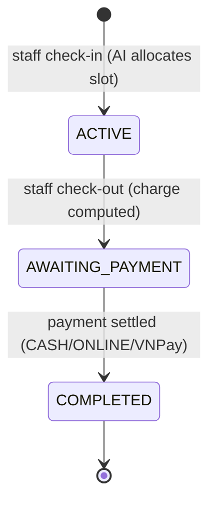

# Parking Session (Check-in / Check-out)

The core operational flow. Staff check in a vehicle — the AI allocator auto-assigns
the best slot (manual mode removed). On exit, the charge is computed and a payment
created. Each session gets a unique QR ticket for scan-to-checkout.

## Flow

1. **Check-in** — staff submits `{ buildingId, vehicleTypeId, licensePlate }`.
   The AI allocator scores all AVAILABLE slots and picks the best one.
   Slot → OCCUPIED, session created with a UUID `ticketCode` (QR-printable).
   Duplicate check-in guard: same plate already ACTIVE → 409.
   - **Reservation check-in**: pass `reservationId` → consumes reservation,
     sets `fromReservation=true`. PAID reservations must have deposit PAID.
     FREE reservations trigger AI allocation at check-in moment.
     PAID reservations use the pre-assigned slot.
2. **Check-out** — charge computed from the vehicle type's `PricingPolicy`
   (rate × hours, grace period, daily cap, peak multiplier).
   Reservation discounts applied: 10% off for free, deposit credit for paid.
   Session → AWAITING_PAYMENT, Payment record created as PENDING.
   Monthly-pass holders: charge = 0, auto-PAID.
3. **Payment settled** — staff settles (CASH/ONLINE) or driver pays via VNPay.
   Slot → AVAILABLE, session → COMPLETED.

## Live Cost Estimate

`GET /api/driver/sessions/{id}/estimate` returns the exact charge the driver
would pay if checked out right now — uses the same `computeCharge` as checkout
(grace period, daily cap, peak multiplier, reservation discounts). The driver
dashboard polls this every 30 seconds.

## Model

| Field | Type | Notes |
|-------|------|-------|
| `user` | FK → users | Driver who owns the session (nullable for walk-ins) |
| `slot` | FK → parking_slot | Assigned slot |
| `vehicleType` | FK → vehicle_type | Vehicle type for pricing |
| `licensePlate` | VARCHAR | Plate number entered at check-in |
| `ticketCode` | UUID (unique) | QR ticket code, auto-generated |
| `checkInAt` | TIMESTAMPTZ | Immutable, set on creation |
| `checkOutAt` | TIMESTAMPTZ | Set on check-out |
| `amountCharged` | NUMERIC | Computed charge (0 for pass holders) |
| `status` | ENUM | ACTIVE → AWAITING_PAYMENT → COMPLETED |
| `autoAllocated` | BOOLEAN | True when AI picked the slot |
| `allocationScore` | JSONB | Full scoring breakdown for audit |
| `fromReservation` | BOOLEAN | True if session originated from a reservation |
| `depositCredit` | NUMERIC | Deposit amount credited at checkout (PAID reservations) |

## Charge Math (`ChargeCalculator`)

- `rate_per_hour × ceiling(hours)` — rounded up per started hour
- First N minutes free (`grace_minutes` from PricingPolicy)
- Daily cap: max charge per 24h stay (optional)
- Peak-hour multiplier: surcharge when check-in falls in 7–9 AM or 5–7 PM
- Reservation discounts:
  - Free reservation: `charge × 0.9` (10% off)
  - Paid reservation: `max(0, charge - depositCredit)`

## API (`/api/staff/sessions`, STAFF role)

| Method | Path | Purpose |
|--------|------|---------|
| POST | `/check-in` | AI-allocated check-in |
| POST | `/{id}/check-out` | Compute charge, create payment |
| GET | `/active` | List active sessions |
| GET | `/{id}` | Session detail |
| GET | `/by-ticket/{ticketCode}` | Lookup by QR ticket code |
| GET | `/by-plate?plate=` | Lookup by license plate |
| GET | `/{id}/ticket.png` | QR code image for the ticket |

## API (`/api/driver/sessions`, USER role)

| Method | Path | Purpose |
|--------|------|---------|
| GET | `/` | List own sessions |
| GET | `/{id}` | Session detail |
| GET | `/{id}/estimate` | Live cost estimate (backend-computed) |
| GET | `/{id}/ticket.png` | QR code image |

## Research Link

Session duration and allocation-method split (auto vs manual) feed into
RQ2 (time-to-park comparison) and RQ4 (peak-hour utilization). The
`autoAllocated` flag and `allocationScore` JSONB make every session auditable.
`fromReservation` + `depositCredit` enable comparing reservation vs walk-in
session costs and fulfillment rates.

## Implementation Files

| Layer | File | Purpose |
|-------|------|---------|
| Service | `session/ParkingSessionService.java` | `checkIn()`, `checkOut()`, `computeCharge()`, QR ticket generation |
| Controller | `session/StaffSessionController.java` | `POST /check-in`, `POST /{id}/check-out`, `GET /active`, `GET /by-ticket/` |
| Controller | `session/DriverSessionController.java` | `GET /`, `GET /{id}`, `GET /{id}/estimate`, `GET /{id}/ticket.png` |
| Calculator | `session/ChargeCalculator.java` | Rate × hours, grace period, daily cap, peak multiplier, reservation discounts |
| Entity | `session/ParkingSession.java` | `SessionStatus`, `allocationScore` JSONB, `fromReservation`, `depositCredit` |
| QR | `common/QrCodeGenerator.java` | Generates PNG QR codes for ticket codes |
| Frontend | `pages/staff/CheckInPage.jsx` | Check-in form with barcode scanner, auto-allocation |
| Frontend | `pages/staff/ActiveSessionsPage.jsx` | Live active sessions list |
| Frontend | `pages/user/MySessionsPage.jsx` | Driver session history with QR codes |
| Frontend | `pages/user/MyParkingPage.jsx` | Active session dashboard with live cost estimate |
| Test | `session/ChargeCalculatorTest.java` | Unit tests for charge math |

## Slide Notes

- **One-liner**: "AI-allocated check-in → QR ticket → live cost estimate → charge calculation with grace/discount → payment settlement."
- **Demo flow**: Staff checks in → QR ticket generated → driver sees live estimate on dashboard → staff checks out → charge computed → payment.

