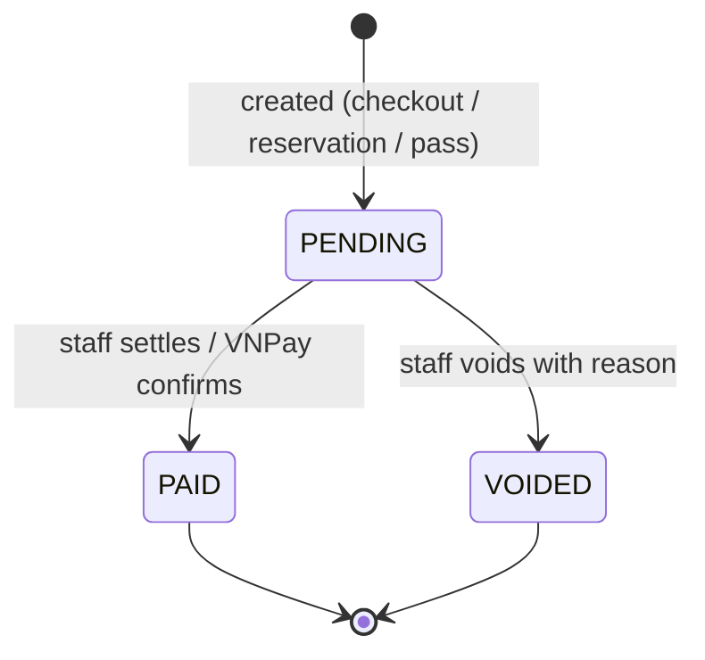

# Payment & Charge Settlement

Two-phase payment lifecycle: check-out creates a PENDING payment, then staff
settles it (CASH / ONLINE) or the driver pays via VNPay. Supports penalty
surcharges from exception reports, void/reversal workflows, and reservation
deposit payments.

## What it does

- Every check-out creates a Payment record for the computed charge.
- Charged exits start PENDING; free exits (within the grace window) are auto-PAID.
- Staff settle a payment by method (CASH or ONLINE); double-settle is rejected.
- Drivers can pay online via VNPay — see [VNPay Online Payment](vnpay-payment.md).
- Monthly-pass holders exit free (charge = 0, auto-PAID).
- Reservation deposits are sessionless payments linked to reservations.
- Managers read revenue (sum of PAID + count) for any time window.

## Payment Types

| Type | Created when | Session | Description field |
|------|-------------|---------|-------------------|
| Session charge | Staff check-out | Yes | null |
| Reservation deposit | Driver creates paid reservation | No | "Reservation deposit · plate · slot" |
| Monthly pass | Driver purchases pass | No | "Monthly pass · plate · type" |

## Payment Lifecycle



## Void Cascading

When staff voids a payment:
- **Session payment**: session → COMPLETED, slot → AVAILABLE
- **Reservation deposit**: linked reservation → CANCELLED, slot → AVAILABLE
- **Monthly pass**: linked pass → EXPIRED

All cascading happens in a single transaction.

## Reservation Discounts at Checkout

- **Free reservation session**: `charge × 0.9` (10% off)
- **Paid reservation session**: `max(0, charge - depositCredit)`
- **Walk-in session**: full rate

## Penalty & Exception Flow

When an exception report is filed (lost ticket, wrong plate, overtime, wrong zone),
the penalty amount is added to the payment:

- `payment.amount` = base parking charge + penalty
- `payment.penalty_amount` records the penalty component separately
- Staff who processed the payment is tracked via `processed_by_staff_id`

## Pricing Math

- **Base rate**: `rate_per_hour × hours` (rounded up per started hour)
- **Grace period**: first N minutes free (configurable per vehicle type)
- **Daily cap**: max charge per 24-hour stay (optional)
- **Peak-hour multiplier**: surcharge when check-in falls in peak hours
  (7–9 AM, 5–7 PM), shared definition with slot allocation

## Staff Payment Page

Shows all PENDING payments with:
- Amount + payment method badge (VNPay / Cash)
- License plate, vehicle type, building/slot (for session payments)
- Description line (for deposit and pass payments)
- Settle cash + Void buttons on every card
- Search across plate, type, slot, and description

## Driver Dashboard (Unpaid Charges)

AWAITING_PAYMENT sessions appear on the driver's main dashboard (`/app`)
with a "Pay via VNPay" button. One click to pay — no need to hunt through
session history.

## API

| Endpoint | Role | Purpose |
|----------|------|---------|
| `POST /api/staff/payments/{id}/settle` | Staff | Settle with `{ method: "CASH" }` |
| `POST /api/staff/payments/{id}/void` | Staff | Void with `{ reason }`, cascades to reservation/pass |
| `GET /api/staff/payments/pending` | Staff | List unsettled payments |
| `GET /api/manager/payments/revenue?from=&to=` | Manager | Revenue report |

## Data Model

```
payment
├── id                    PK
├── session_id            FK → parking_session (UNIQUE, optional)
├── amount                NUMERIC (base + penalty)
├── penalty_amount        NUMERIC (0 if no exception)
├── description           VARCHAR (identifies sessionless payments)
├── processed_by_staff_id FK → users (nullable)
├── method                ENUM (CASH | ONLINE | VNPAY)
├── status                ENUM (PENDING | PAID | VOIDED)
├── gateway_ref           VARCHAR (VNPay txn ref, unique)
├── gateway_txn_no        VARCHAR (VNPay's own txn number)
├── gateway_response_code VARCHAR ("00" = success)
├── void_reason           VARCHAR
├── created_at / paid_at / voided_at   TIMESTAMPTZ
```

## Research Link (RQ4)

Peak-hour pricing shares the same time-window definition as the AI allocation
`peakHour` factor — a single config drives both surcharge and scoring, making
the system coherent when analyzing peak-hour utilization.
