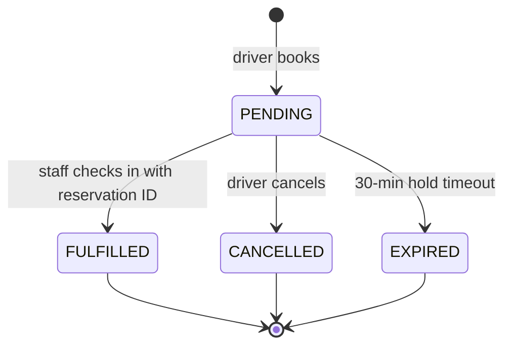

# Reservation (Pre-Book a Slot)

Drivers pre-book a parking slot by vehicle type. The AI allocator picks the
best available slot, marks it RESERVED, and holds it for 30 minutes. Staff
convert the reservation into an active session at the gate.

## What it does

- Driver selects building + vehicle type + license plate → system auto-allocates
  the best slot using the same AI scoring as check-in.
- The slot is held as RESERVED for 30 minutes; if the driver does not arrive,
  it auto-releases (status → EXPIRED, slot → AVAILABLE).
- Staff convert a reservation into an active session at the gate by passing
  the reservation ID during check-in.
- Drivers can list and cancel their own pending reservations.

## Reservation Lifecycle



## Flow

1. **Driver** → `POST /api/driver/reservations` with `{ buildingId, vehicleTypeId, licensePlate }`
2. **Backend** → AI allocator scores all AVAILABLE slots → picks best → flips slot to RESERVED
3. **Backend** → returns reservation with slot code, floor, hold expiry
4. **Driver arrives** → staff scans/enters reservation ID at check-in
5. **Staff** → `POST /api/staff/sessions/check-in` with `{ reservationId }` → converts
   to active session, reservation status → FULFILLED
6. **If no-show** → scheduler or lazy check expires old reservations

## Allocation Score

The reservation stores the full scoring breakdown as a JSONB `allocation_score`
field, making it auditable. The scoring weights are identical to check-in
allocation — see [AI Slot Allocation](ai-slot-allocation.md).

## API

| Endpoint | Role | Purpose |
|----------|------|---------|
| `POST /api/driver/reservations` | Driver | Create reservation |
| `GET /api/driver/reservations` | Driver | List own reservations |
| `DELETE /api/driver/reservations/{id}` | Driver | Cancel pending reservation |
| `GET /api/manager/reservations` | Manager | List all reservations |

## Data Model

```
reservation
├── id               PK
├── user_id          FK → users
├── slot_id          FK → parking_slot
├── vehicle_type_id  FK → vehicle_type
├── license_plate    VARCHAR
├── hold_until       TIMESTAMPTZ
├── status           ENUM (PENDING | FULFILLED | CANCELLED | EXPIRED)
├── allocation_score JSONB (scoring breakdown)
└── created_at       TIMESTAMPTZ
```

## Research Link (RQ2)

Reservations test whether AI auto-allocation reduces time-to-park compared to
free choice: the driver does not pick a slot — the algorithm does. Comparing
reservation fulfillment rates and arrival times against walk-in check-ins
measures the allocation's real-world benefit.
