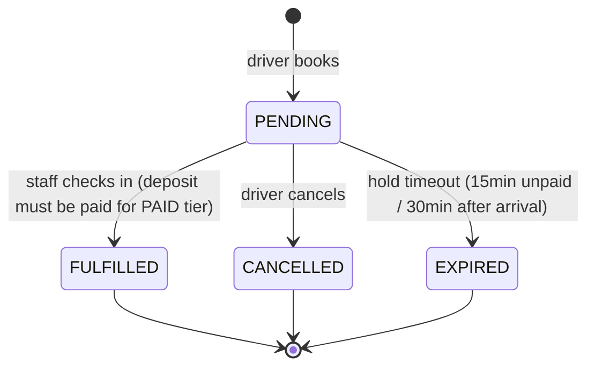

# Reservation (Pre-Book a Slot)

Drivers pre-book a parking slot with two options: **Free** (AI assigns at
check-in, 10% discount) or **Paid** (pick a specific slot with AI suggestion,
pay a 1-hour deposit via VNPay, slot guaranteed after payment).

## Reservation Tiers

| | Free Reservation | Paid Reservation |
|---|---|---|
| Slot selection | AI assigns best slot at check-in | Driver picks (AI suggestion shown) |
| Guarantee | Best-effort (building could be full) | Yes — slot locked after deposit paid |
| Cost | **10% discount** on parking rate | 1hr booking fee (non-refundable), credited at checkout |
| No-show | Expires, nothing lost | Expires after grace period, fee forfeit, slot released |
| Cancel | Free cancel anytime | Cancel OK, fee non-refundable |
| Duplicate plate | Blocked — one PENDING reservation per plate | Same |

Both tiers share:
- **Booking window**: today only, max 3 hours ahead
- **Grace period**: 30 minutes after reserved arrival time
- **Expiry**: auto-released if driver doesn't arrive within grace window

## Reservation Lifecycle



## Free Reservation Flow

1. **Driver** selects building + vehicle type + plate + arrival time
2. **Backend** creates reservation with no slot assigned, sets `holdUntil = arrivalTime + 30min`
3. **Driver arrives** → staff scans reservation at check-in
4. **Backend** runs AI slot allocation at that moment → assigns best available slot
5. **Session** gets 10% discount on the parking rate

If the building is full at arrival, the system returns an error — driver can
try another building or wait.

## Paid Reservation Flow

1. **Driver** selects building + vehicle type + plate + arrival time
2. **Frontend** fetches AI-ranked slot suggestions → driver picks a slot
   - AI recommendation card at top with full score breakdown (vehicle type match, load balance, distance, peak-hour)
   - Slot grid grouped by floor below
3. **Backend** locks slot as RESERVED, creates deposit payment, sets `holdUntil = now + 15min` (payment window)
4. **Frontend** shows confirmation card: "Reservation created — pay deposit to confirm"
5. **Driver** clicks "Pay via VNPay" → redirected to VNPay
6. **VNPay callback** marks payment PAID → extends `holdUntil` to `reservedStart + 30min`
7. **Driver arrives** → staff scans reservation at check-in (blocked if deposit unpaid)
8. **At checkout**: `finalCharge = max(0, computed - deposit)`

### Payment Window

- Slot is locked for 15 minutes while driver pays
- If payment not completed within 15min, sweep releases the slot and expires the reservation
- Driver sees "Awaiting payment" badge — can only Cancel (no QR for check-in)
- After payment confirmed: slot info and QR become visible

### Cancel / Void

- **Driver cancels** PENDING reservation → slot released, deposit payment voided
- **Staff voids** deposit payment → reservation auto-cancelled, slot released
- **Staff voids** pass payment → pass set to EXPIRED

## AI Slot Suggestion (Paid)

When a driver selects Paid reservation, the frontend calls the `/suggest`
endpoint. The backend runs the same AI scoring algorithm used for check-in
allocation — scoring by floor load balance, vehicle type match, distance to
entry, and peak-hour factor.

The AI recommendation card shows the full score breakdown (out of 100) with
per-criterion bars. Drivers can follow the AI suggestion or pick any available
slot from the floor-grouped grid below.

## API

| Endpoint | Role | Purpose |
|----------|------|---------|
| `POST /api/driver/reservations` | Driver | Create reservation (free or paid) |
| `GET /api/driver/reservations` | Driver | List own reservations |
| `DELETE /api/driver/reservations/{id}` | Driver | Cancel pending reservation |
| `GET /api/driver/reservations/suggest` | Driver | AI-ranked slot suggestions for paid tier |
| `GET /api/manager/reservations` | Manager | List all reservations |

## Data Model

```
reservation
├── id                  PK
├── user_id             FK → users
├── slot_id             FK → parking_slot (nullable for FREE)
├── building_id         FK → parking_building
├── vehicle_type_id     FK → vehicle_type
├── license_plate       VARCHAR (unique per PENDING status)
├── reservation_type    ENUM (FREE | PAID)
├── reserved_start      TIMESTAMPTZ (driver's chosen arrival time)
├── hold_until          TIMESTAMPTZ (15min for unpaid PAID, reservedStart+30min after payment/FREE)
├── status              ENUM (PENDING | FULFILLED | CANCELLED | EXPIRED)
├── deposit_amount      NUMERIC (1hr rate, PAID only)
├── deposit_payment_id  FK → payment (PAID only)
├── allocation_score    JSONB (scoring breakdown)
└── created_at          TIMESTAMPTZ

parking_session (additions)
├── deposit_credit      NUMERIC (deposit amount credited at checkout)
└── from_reservation    BOOLEAN (true if session originated from reservation)

payment (additions)
└── description         VARCHAR (e.g. "Reservation deposit · 51A-123 · A-01")
```

## Checkout Discount Logic

- **Free reservation session**: `finalCharge = computedCharge × 0.9` (10% off)
- **Paid reservation session**: `finalCharge = max(0, computedCharge - depositCredit)`
- **Walk-in session**: full rate, no discount

## Staff Payments Page

Deposit payments appear in the staff pending payments list with a description
line (plate + slot code). Staff can settle cash or void. Voiding a deposit
auto-cancels the linked reservation and releases the slot.

## Research Link (RQ2–RQ4)

- **RQ2**: Free reservations test whether AI auto-allocation at check-in reduces
  time-to-park vs. paid reservations where the driver pre-selects a slot.
- **RQ3**: The `/suggest` endpoint exposes allocation criteria (distance, floor
  load, vehicle type match, peak factor) — comparing driver choices against AI
  suggestions measures which criteria matter most.
- **RQ4**: Reservation data (fulfillment rates, no-show rates, peak-hour bookings)
  measures whether the allocation algorithm improves peak-hour utilization.

## Implementation Files

| Layer | File | Purpose |
|-------|------|---------|
| Service | `reservation/ReservationService.java` | `createFree()`, `createPaid()`, `cancel()`, `suggest()`, `fulfill()` |
| Controller | `reservation/DriverReservationController.java` | `POST/GET/DELETE /api/driver/reservations`, `GET /suggest` |
| Controller | `reservation/ManagerReservationController.java` | `GET /api/manager/reservations` |
| Job | `reservation/ReservationExpiryJob.java` | `@Scheduled` sweep: releases unpaid holds after 15min, expires past-due reservations |
| Entity | `reservation/Reservation.java` | `ReservationType` (FREE/PAID), `ReservationStatus` (PENDING/FULFILLED/CANCELLED/EXPIRED) |
| Frontend | `pages/user/ReservationsPage.jsx` | Driver reservation list + create form |
| Frontend | `pages/staff/CheckInPage.jsx` | Staff check-in consumes reservations |
| Test | `reservation/ReservationServiceTest.java` | Unit tests for both tiers |

## Slide Notes

- **One-liner**: "Two-tier pre-booking: free with AI assignment + 10% discount, or paid with guaranteed slot via VNPay deposit."
- **Demo flow**: Driver creates paid reservation → AI suggests best slot → picks slot → pays deposit → staff checks in via reservation QR.
- **Grading hook**: Tests RQ2 (AI vs driver choice), RQ3 (which criteria drive driver decisions), RQ4 (reservation fulfillment rates at peak hours).

