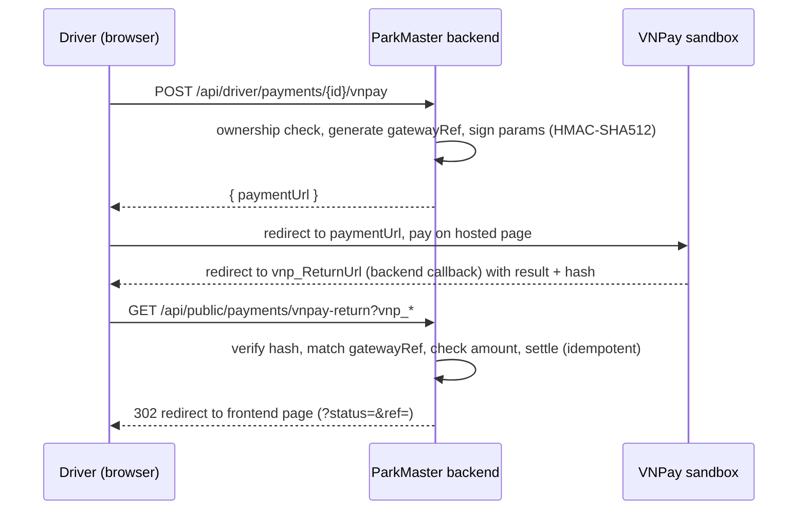

# VNPay Online Payment Gateway

Real Vietnam payment gateway (VNPay sandbox, API v2.1.0). Handles three payment
types: parking session charges, reservation deposits, and monthly pass purchases.
The backend builds a signed checkout URL, VNPay collects the money, then calls
back to verify and settle.

## Why it matters

- VNPay is the de-facto payment gateway for SWP391 / Vietnamese student projects.
- Demonstrates a real third-party integration: redirect flow, HMAC signing,
  server-to-server verification, idempotent settlement — not a fake button.

## Payment Types via VNPay

| Type | Trigger | After payment confirmed |
|------|---------|----------------------|
| Session charge | Driver clicks "Pay via VNPay" on dashboard | Session → COMPLETED, slot freed |
| Reservation deposit | Driver creates paid reservation | holdUntil extended to reservedStart + 30min |
| Monthly pass | Driver purchases pass | Pass → ACTIVE |

## Actors & flow

## Smart Redirect Routing

After VNPay callback, the backend redirects to the correct frontend page based
on payment type:
- **Session payment** → `/sessions`
- **Reservation deposit** → `/reservations`
- **Monthly pass** → `/my-passes`

Determined by checking: session FK present → sessions; linked reservation found →
reservations; otherwise → passes.

## API

| Method | Path | Auth | Purpose |
|---|---|---|---|
| POST | `/api/driver/payments/{id}/vnpay` | USER (own payment) | Start checkout → `{ paymentUrl }` |
| GET | `/api/public/payments/vnpay-return` | public (no JWT) | VNPay callback → verify, settle, redirect |

The callback is **public** on purpose: it is hit by the user's browser (and could be
hit by VNPay's servers), which carry no app JWT. Trust comes from the signature, not
from auth. Non-owner start requests return `404` (no ownership leak); already-paid or
voided payments return `409`.

## Signature (the security-critical part)

VNPay v2.1.0 rule, applied identically when signing and verifying:

1. Sort all `vnp_*` fields by name.
2. Join as `name=urlEncode(value)` pairs separated by `&` → the *hash data*.
3. `vnp_SecureHash = HMAC-SHA512(merchantHashSecret, hashData)` (lowercase hex).

Verification recomputes the HMAC over every returned field except `vnp_SecureHash`
/ `vnp_SecureHashType` and compares (case-insensitive). On the callback the backend
also re-checks `vnp_ResponseCode == "00"`, `vnp_TransactionStatus == "00"`, and that
`vnp_Amount` equals the stored charge × 100 — so a tampered amount or a forged
"success" is rejected. Amounts are sent in VND × 100 per VNPay convention.

## Idempotent settlement with cascading

`vnp_TxnRef` is `paymentId_yyyyMMddHHmmss` (Asia/Ho_Chi_Minh), unique per attempt and
stored on the Payment as `gatewayRef`. The callback looks the payment up by that ref.
Settlement only fires when the payment is still `PENDING`, so a duplicated callback
(browser refresh, retry) records the gateway response without double-charging.

On success, cascading actions run:
- **Session payment**: slot → AVAILABLE, session → COMPLETED
- **Pass payment**: pass → ACTIVE
- **Reservation deposit**: holdUntil extended to `reservedStart + 30min`

## Reservation Deposit Flow

Paid reservations lock a slot for 15 minutes (payment window). The driver sees a
confirmation card with "Pay via VNPay" button. After VNPay confirms payment, the
backend extends `holdUntil` to the real arrival window. If payment never completes,
the sweep releases the slot after 15 minutes.

Check-in is blocked for PAID reservations until the deposit is confirmed PAID.

## Configuration (`parkmaster.vnpay.*`)

| Property | Env | Default |
|---|---|---|
| `tmn-code` | `VNPAY_TMN_CODE` | _(empty)_ |
| `hash-secret` | `VNPAY_HASH_SECRET` | _(empty)_ |
| `pay-url` | `VNPAY_PAY_URL` | `https://sandbox.vnpayment.vn/paymentv2/vpcpay.html` |
| `return-url` | `VNPAY_RETURN_URL` | `http://localhost:5000/api/public/payments/vnpay-return` |
| `result-url` | `VNPAY_RESULT_URL` | `http://localhost:5173/app` |

## Implementation Files

| Layer | File | Purpose |
|-------|------|---------|
| Service | `payment/VnPayService.java` | `buildPaymentUrl()`, HMAC-SHA512 signing, `isValidSignature()` callback verification |
| Controller | `payment/PublicPaymentController.java` | `GET /vnpay-return` — callback handler, signature verification, smart redirect |
| Controller | `payment/VnPayIpnController.java` | `GET /api/public/payments/vnpay-ipn` — server-to-server IPN endpoint |
| Service | `payment/PaymentService.java` | `handleVnPayReturn()` — idempotent settlement, `activateLinkedPass()` |
| Config | `application.yml` | `parkmaster.vnpay.*` configuration block |
| Frontend | `pages/user/MyParkingPage.jsx` | "Pay via VNPay" button on unpaid charges |
| Frontend | `pages/user/PassesPage.jsx` | Auto-redirect to VNPay after pass registration |
| Test | `payment/VnPayServiceTest.java` | Signature generation and verification tests |

## Slide Notes

- **One-liner**: "Real VNPay sandbox integration — HMAC-SHA512 signing, server callback verification, idempotent settlement with cascading actions."
- **Demo flow**: Driver clicks "Pay via VNPay" → redirected to VNPay sandbox → pays → redirected back → payment PAID → pass/session activated.

