Software Design Specification

**ParkMaster — Parking Building Management System**

**Version: 1.0**

– FPT University, SWP391 –

| Date | A/M/D | In charge | Change Description |
| --- | --- | --- | --- |
| 2026-07-01 | A | Team | Initial SDS §I — Code Packages, Database Design |

---

# I. Overview

> **Scope.** These code designs cover the **backend service layer** (Spring Boot:
> controllers, services, entities, repositories, and their SQL) — the tier with an
> object-oriented class model to design. The React SPA is a functional-component
> client with no class hierarchy to diagram; its **screen and navigation design is
> specified in SRS §2.1 (Screens Flow)**. Here it consumes the REST APIs and appears
> as an external actor ("Driver", "Staff", etc.) in the sequence diagrams.

## 1. Code Packages

Backend package layout under `com.parkmaster.*` (Spring Boot, layered by
domain). Each package owns its entity, repository, service, and controller(s)
for one bounded area; consistent with SRS §3.2 feature grouping.

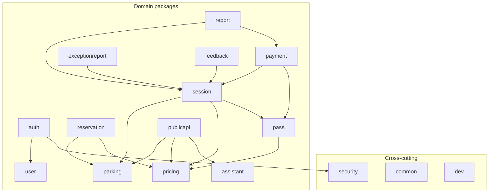
```mermaid
flowchart TB
    subgraph Cross-cutting
        security[security]
        common[common]
        dev[dev]
    end

    subgraph Domain packages
        auth[auth]
        user[user]
        parking[parking]
        pricing[pricing]
        session[session]
        reservation[reservation]
        payment[payment]
        exceptionreport[exceptionreport]
        pass[pass]
        feedback[feedback]
        report[report]
        assistant[assistant]
        publicapi[publicapi]
    end

    auth --> user
    auth --> security
    session --> parking
    session --> pricing
    session --> pass
    reservation --> parking
    reservation --> pricing
    payment --> session
    payment --> pass
    exceptionreport --> session
    feedback --> session
    pass --> pricing
    report --> session
    report --> payment
    publicapi --> parking
    publicapi --> pricing
    publicapi --> assistant
```

***Package descriptions***

| No | Package | Description |
| --- | --- | --- |
| 01 | `assistant` | AI chat assistant controller/service (Gemini integration + local FAQ fallback). |
| 02 | `auth` | Register/login, JWT issuance, password reset. |
| 03 | `common` | `ApiException`, `GlobalExceptionHandler` (RFC7807 errors). |
| 04 | `dev` | Dev-profile data seeder. |
| 05 | `exceptionreport` | Exception report entity, staff/manager controllers, resolve flow. |
| 06 | `feedback` | Feedback entity, driver submit + manager view controllers. |
| 07 | `parking` | `ParkingBuilding`, `Floor`, `ParkingSlot` entities + manager CRUD controller. |
| 08 | `pass` | Monthly pass entity, driver purchase + manager activate/revoke controllers. |
| 09 | `payment` | `Payment` entity, driver/staff/manager/public controllers, VNPay integration. |
| 10 | `pricing` | `VehicleType`, `PricingPolicy` entities + manager controller. |
| 11 | `publicapi` | Public (no-auth) controller: health, availability, public pricing. |
| 12 | `report` | Manager analytics/report controller (revenue, check-ins, duration, allocation comparison). |
| 13 | `reservation` | `Reservation` entity, driver controller, AI slot suggestion. |
| 14 | `security` | `JwtService`, `JwtAuthFilter`, `SecurityConfig` (role-based `/api/**` routing). |
| 15 | `session` | `ParkingSession` entity, `ChargeCalculator`, `SlotAllocationService`, staff/driver controllers. |
| 16 | `user` | `User`, `Role`, repo, admin user-management controller, driver profile controller. |

## 2. Database Design

### a. Database Schema

Reused verbatim from `docs/erd/erd.md` (generated from Flyway migrations
`V1`–`V23`, cross-checked against JPA entities). 13 tables.

```mermaid
erDiagram
    USERS {
        BIGSERIAL id PK
        VARCHAR email UK
        VARCHAR password_hash
        VARCHAR full_name
        VARCHAR role
        BOOLEAN active
        TIMESTAMPTZ created_at
    }

    PARKING_BUILDING {
        BIGSERIAL id PK
        VARCHAR name
        VARCHAR address
        TIMESTAMPTZ created_at
    }

    FLOOR {
        BIGSERIAL id PK
        BIGINT building_id FK
        BIGINT vehicle_type_id FK
        INT level
        VARCHAR name
        TIMESTAMPTZ created_at
    }

    PARKING_SLOT {
        BIGSERIAL id PK
        BIGINT floor_id FK
        VARCHAR code
        VARCHAR status
        TIMESTAMPTZ created_at
    }

    VEHICLE_TYPE {
        BIGSERIAL id PK
        VARCHAR name UK
        VARCHAR description
        TIMESTAMPTZ created_at
    }

    PRICING_POLICY {
        BIGSERIAL id PK
        BIGINT vehicle_type_id FK_UK
        NUMERIC rate_per_hour
        NUMERIC daily_cap
        INT grace_minutes
        NUMERIC peak_multiplier
        NUMERIC monthly_pass_price
        BOOLEAN is_active
        TIMESTAMPTZ created_at
    }

    PARKING_SESSION {
        BIGSERIAL id PK
        BIGINT user_id FK
        BIGINT slot_id FK
        BIGINT vehicle_type_id FK
        VARCHAR license_plate
        VARCHAR ticket_code UK
        TIMESTAMPTZ check_in_at
        TIMESTAMPTZ check_out_at
        NUMERIC amount_charged
        VARCHAR status
        BOOLEAN auto_allocated
        JSONB allocation_score
        NUMERIC deposit_credit
        BOOLEAN from_reservation
        TIMESTAMPTZ created_at
    }

    PAYMENT {
        BIGSERIAL id PK
        BIGINT session_id FK_UK
        BIGINT processed_by_staff_id FK
        NUMERIC amount
        NUMERIC penalty_amount
        VARCHAR method
        VARCHAR status
        VARCHAR description
        VARCHAR gateway_ref UK
        VARCHAR gateway_txn_no
        VARCHAR gateway_response_code
        TIMESTAMPTZ created_at
        TIMESTAMPTZ paid_at
        TIMESTAMPTZ voided_at
        VARCHAR void_reason
    }

    RESERVATION {
        BIGSERIAL id PK
        BIGINT user_id FK
        BIGINT slot_id FK
        BIGINT vehicle_type_id FK
        BIGINT building_id FK
        BIGINT deposit_payment_id FK
        VARCHAR license_plate
        TIMESTAMPTZ hold_until
        TIMESTAMPTZ reserved_start
        VARCHAR reservation_type
        NUMERIC deposit_amount
        JSONB allocation_score
        TIMESTAMPTZ created_at
        VARCHAR status
    }

    EXCEPTION_REPORT {
        BIGSERIAL id PK
        BIGINT session_id FK
        BIGINT reported_by FK
        VARCHAR type
        TEXT description
        VARCHAR status
        TEXT resolution_note
        TIMESTAMPTZ created_at
        TIMESTAMPTZ resolved_at
    }

    MONTHLY_PASS {
        BIGSERIAL id PK
        BIGINT user_id FK
        BIGINT vehicle_type_id FK
        BIGINT payment_id FK
        VARCHAR license_plate
        DATE valid_from
        DATE valid_until
        VARCHAR status
        TIMESTAMPTZ created_at
    }

    FEEDBACK {
        BIGSERIAL id PK
        BIGINT session_id FK_UK
        BIGINT user_id FK
        SMALLINT rating
        VARCHAR comment
        TIMESTAMPTZ created_at
    }

    PASSWORD_RESET_TOKEN {
        BIGSERIAL id PK
        BIGINT user_id FK
        VARCHAR token UK
        TIMESTAMPTZ expires_at
        BOOLEAN used
        TIMESTAMPTZ created_at
    }

    PARKING_BUILDING ||--o{ FLOOR : contains
    VEHICLE_TYPE ||--o{ FLOOR : assigned_to
    FLOOR ||--o{ PARKING_SLOT : contains
    VEHICLE_TYPE ||--|| PRICING_POLICY : priced_by

    USERS ||--o{ PARKING_SESSION : owns
    PARKING_SLOT ||--o{ PARKING_SESSION : used_by
    VEHICLE_TYPE ||--o{ PARKING_SESSION : classifies
    PARKING_SESSION ||--o| PAYMENT : charged_by

    USERS ||--o{ PAYMENT : processes
    USERS ||--o{ RESERVATION : creates
    PARKING_SLOT ||--o{ RESERVATION : reserved_slot
    VEHICLE_TYPE ||--o{ RESERVATION : requested_type
    PARKING_BUILDING ||--o{ RESERVATION : requested_building
    PAYMENT ||--o{ RESERVATION : deposit_for

    PARKING_SESSION ||--o{ EXCEPTION_REPORT : has
    USERS ||--o{ EXCEPTION_REPORT : reports
    USERS ||--o{ MONTHLY_PASS : owns
    VEHICLE_TYPE ||--o{ MONTHLY_PASS : applies_to
    PAYMENT ||--o{ MONTHLY_PASS : pays_for
    PARKING_SESSION ||--o| FEEDBACK : receives
    USERS ||--o{ FEEDBACK : writes
    USERS ||--o{ PASSWORD_RESET_TOKEN : has
```

Full relationship summary, enum values, and constraints/indexes: see
`docs/erd/erd.md` (not duplicated here).

### b. Table Description

| No | Table | PK | Key FKs | Description |
| --- | --- | --- | --- | --- |
| 01 | `users` | `id` | — | Accounts for all 4 roles; `role` enum (`ADMIN`/`MANAGER`/`STAFF`/`USER`). |
| 02 | `parking_building` | `id` | — | A managed parking building. |
| 03 | `floor` | `id` | `building_id`→parking_building, `vehicle_type_id`→vehicle_type | Floor within a building, optionally dedicated to one vehicle type. |
| 04 | `parking_slot` | `id` | `floor_id`→floor | Individual slot; `status` enum (`AVAILABLE`/`OCCUPIED`/`RESERVED`/`MAINTENANCE`/`LOCKED`). |
| 05 | `vehicle_type` | `id` | — | Vehicle category (e.g. motorbike, car). |
| 06 | `pricing_policy` | `id` | `vehicle_type_id`→vehicle_type (unique) | Rate/hour, daily cap, grace period, peak multiplier, monthly pass price per vehicle type. |
| 07 | `parking_session` | `id` | `user_id`→users, `slot_id`→parking_slot, `vehicle_type_id`→vehicle_type | Check-in→check-out lifecycle; AI allocation score, charge, status. |
| 08 | `payment` | `id` | `session_id`→parking_session (unique), `processed_by_staff_id`→users | Payment for a session or a monthly pass; method (`CASH`/`ONLINE`/`VNPAY`), status (`PENDING`/`PAID`/`VOIDED`). |
| 09 | `reservation` | `id` | `user_id`→users, `slot_id`→parking_slot, `vehicle_type_id`→vehicle_type, `building_id`→parking_building, `deposit_payment_id`→payment | Pre-booked slot, free or paid, with AI-suggested allocation. |
| 10 | `exception_report` | `id` | `session_id`→parking_session, `reported_by`→users | Lost ticket / wrong plate / overtime / wrong zone report. |
| 11 | `monthly_pass` | `id` | `user_id`→users, `vehicle_type_id`→vehicle_type, `payment_id`→payment | Driver's recurring pass; active pass zeroes checkout charge. |
| 12 | `feedback` | `id` | `session_id`→parking_session (unique), `user_id`→users | One rating/comment per completed session. |
| 13 | `password_reset_token` | `id` | `user_id`→users | Single-use token for forgot/reset password flow. |

---

# II. Code Designs

Six key features, matching SRS §II's functional descriptions. Class names,
fields, and methods below are taken verbatim from
`backend/src/main/java/com/parkmaster/**`.

## 1. Login (UC-2)

### a. Class Diagram

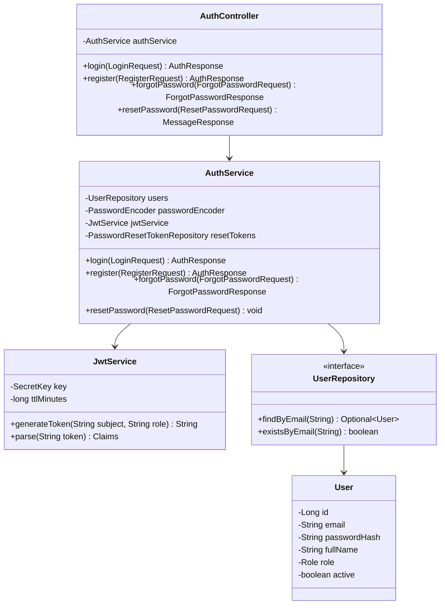
```mermaid
classDiagram
    class AuthController {
        -AuthService authService
        +login(LoginRequest) AuthResponse
        +register(RegisterRequest) AuthResponse
        +forgotPassword(ForgotPasswordRequest) ForgotPasswordResponse
        +resetPassword(ResetPasswordRequest) MessageResponse
    }
    class AuthService {
        -UserRepository users
        -PasswordEncoder passwordEncoder
        -JwtService jwtService
        -PasswordResetTokenRepository resetTokens
        +login(LoginRequest) AuthResponse
        +register(RegisterRequest) AuthResponse
        +forgotPassword(ForgotPasswordRequest) ForgotPasswordResponse
        +resetPassword(ResetPasswordRequest) void
    }
    class JwtService {
        -SecretKey key
        -long ttlMinutes
        +generateToken(String subject, String role) String
        +parse(String token) Claims
    }
    class UserRepository {
        <<interface>>
        +findByEmail(String) Optional~User~
        +existsByEmail(String) boolean
    }
    class User {
        -Long id
        -String email
        -String passwordHash
        -String fullName
        -Role role
        -boolean active
    }
    AuthController --> AuthService
    AuthService --> UserRepository
    AuthService --> JwtService
    UserRepository --> User
```

### b. Class Specifications

#### AuthController Class

| No | Method | Description |
| --- | --- | --- |
| 01 | `login` | Receives `email`/`password`, delegates to `AuthService.login`, returns JWT + user info or 401. |
| 02 | `register` | Self-registers a new `USER` (driver) account. |

#### AuthService Class

| No | Method | Description |
| --- | --- | --- |
| 01 | `login` | Loads the user by email, rejects if inactive or `PasswordEncoder.matches` fails (BCrypt), else issues a JWT via `JwtService.generateToken`. |
| 02 | `register` | Rejects duplicate email, hashes the password, saves a new `User` with `Role.USER`. |

### c. Sequence Diagram(s)

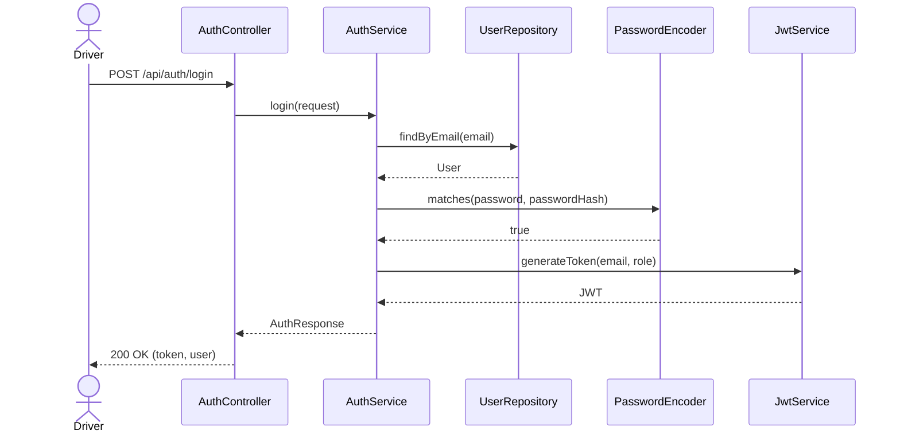
```mermaid
sequenceDiagram
    actor Driver
    participant AuthController
    participant AuthService
    participant UserRepository
    participant PasswordEncoder
    participant JwtService

    Driver->>AuthController: POST /api/auth/login
    AuthController->>AuthService: login(request)
    AuthService->>UserRepository: findByEmail(email)
    UserRepository-->>AuthService: User
    AuthService->>PasswordEncoder: matches(password, passwordHash)
    PasswordEncoder-->>AuthService: true
    AuthService->>JwtService: generateToken(email, role)
    JwtService-->>AuthService: JWT
    AuthService-->>AuthController: AuthResponse
    AuthController-->>Driver: 200 OK (token, user)
```

### d. Database Queries

```sql
-- AuthService.login
SELECT * FROM users WHERE email = ?;
```

JPA derived query: `UserRepository.findByEmail(String email): Optional<User>`.

---

## 2. Check-In / Check-Out Vehicle (UC-13, UC-14)

### a. Class Diagram

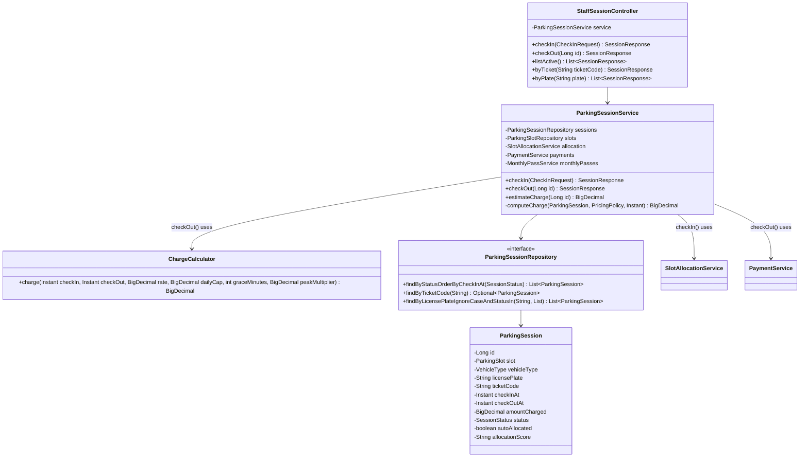
```mermaid
classDiagram
    class StaffSessionController {
        -ParkingSessionService service
        +checkIn(CheckInRequest) SessionResponse
        +checkOut(Long id) SessionResponse
        +listActive() List~SessionResponse~
        +byTicket(String ticketCode) SessionResponse
        +byPlate(String plate) List~SessionResponse~
    }
    class ParkingSessionService {
        -ParkingSessionRepository sessions
        -ParkingSlotRepository slots
        -SlotAllocationService allocation
        -PaymentService payments
        -MonthlyPassService monthlyPasses
        +checkIn(CheckInRequest) SessionResponse
        +checkOut(Long id) SessionResponse
        +estimateCharge(Long id) BigDecimal
        -computeCharge(ParkingSession, PricingPolicy, Instant) BigDecimal
    }
    class ChargeCalculator {
        +charge(Instant checkIn, Instant checkOut, BigDecimal rate, BigDecimal dailyCap, int graceMinutes, BigDecimal peakMultiplier) BigDecimal
    }
    class ParkingSession {
        -Long id
        -ParkingSlot slot
        -VehicleType vehicleType
        -String licensePlate
        -String ticketCode
        -Instant checkInAt
        -Instant checkOutAt
        -BigDecimal amountCharged
        -SessionStatus status
        -boolean autoAllocated
        -String allocationScore
    }
    class ParkingSessionRepository {
        <<interface>>
        +findByStatusOrderByCheckInAt(SessionStatus) List~ParkingSession~
        +findByTicketCode(String) Optional~ParkingSession~
        +findByLicensePlateIgnoreCaseAndStatusIn(String, List) List~ParkingSession~
    }
    ParkingSessionService --> ChargeCalculator : checkOut() uses
    StaffSessionController --> ParkingSessionService
    ParkingSessionService --> ParkingSessionRepository
    ParkingSessionService --> SlotAllocationService : checkIn() uses
    ParkingSessionService --> PaymentService : checkOut() uses
    ParkingSessionRepository --> ParkingSession
```

### b. Class Specifications

#### ParkingSessionService Class

| No | Method | Description |
| --- | --- | --- |
| 01 | `checkIn` | Validates plate not already parked, runs `SlotAllocationService.rank` when no `slotId` given, sets the winning slot `OCCUPIED`, persists `allocation_score` JSON, saves a new `ParkingSession`. |
| 02 | `checkOut` | Loads the active session, looks up `PricingPolicy`, computes the charge via `computeCharge`, calls `PaymentService.createForSession`, frees the slot if the charge is zero (active pass), else sets `AWAITING_PAYMENT`. |
| 03 | `computeCharge` | Zeroes the charge if `MonthlyPassService.hasActivePass` matches; else applies the peak multiplier and calls `ChargeCalculator.charge`. |

#### ChargeCalculator Class

| No | Method | Description |
| --- | --- | --- |
| 01 | `charge` | Pure function: minutes parked minus grace, billed per started hour × `ratePerHour`, capped per started day at `dailyCap`, then × `peakMultiplier`. |

### c. Sequence Diagram(s)

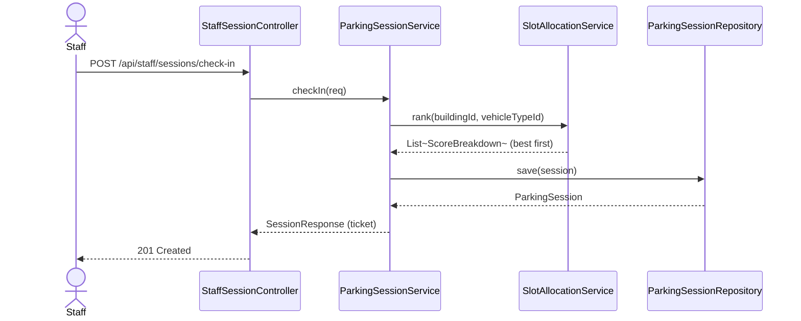
```mermaid
sequenceDiagram
    actor Staff
    participant StaffSessionController
    participant ParkingSessionService
    participant SlotAllocationService
    participant ParkingSessionRepository

    Staff->>StaffSessionController: POST /api/staff/sessions/check-in
    StaffSessionController->>ParkingSessionService: checkIn(req)
    ParkingSessionService->>SlotAllocationService: rank(buildingId, vehicleTypeId)
    SlotAllocationService-->>ParkingSessionService: List~ScoreBreakdown~ (best first)
    ParkingSessionService->>ParkingSessionRepository: save(session)
    ParkingSessionRepository-->>ParkingSessionService: ParkingSession
    ParkingSessionService-->>StaffSessionController: SessionResponse (ticket)
    StaffSessionController-->>Staff: 201 Created
```

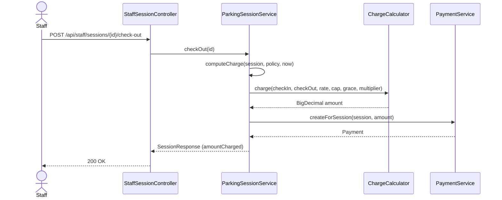
```mermaid
sequenceDiagram
    actor Staff
    participant StaffSessionController
    participant ParkingSessionService
    participant ChargeCalculator
    participant PaymentService

    Staff->>StaffSessionController: POST /api/staff/sessions/{id}/check-out
    StaffSessionController->>ParkingSessionService: checkOut(id)
    ParkingSessionService->>ParkingSessionService: computeCharge(session, policy, now)
    ParkingSessionService->>ChargeCalculator: charge(checkIn, checkOut, rate, cap, grace, multiplier)
    ChargeCalculator-->>ParkingSessionService: BigDecimal amount
    ParkingSessionService->>PaymentService: createForSession(session, amount)
    PaymentService-->>ParkingSessionService: Payment
    ParkingSessionService-->>StaffSessionController: SessionResponse (amountCharged)
    StaffSessionController-->>Staff: 200 OK
```

### d. Database Queries

```sql
-- ParkingSessionService.checkIn
SELECT * FROM parking_slot WHERE floor_id IN (
    SELECT id FROM floor WHERE building_id = ?
) AND status = 'AVAILABLE';

INSERT INTO parking_session
    (slot_id, vehicle_type_id, license_plate, ticket_code, check_in_at,
     status, auto_allocated, allocation_score)
VALUES (?, ?, ?, ?, now(), 'ACTIVE', ?, ?::jsonb);

-- ParkingSessionService.checkOut
SELECT * FROM parking_session WHERE id = ? AND status = 'ACTIVE';
SELECT * FROM pricing_policy WHERE vehicle_type_id = ?;
UPDATE parking_session SET check_out_at = now(), amount_charged = ?, status = ? WHERE id = ?;
INSERT INTO payment (session_id, amount, status) VALUES (?, ?, ?);
```

JPA derived queries: `ParkingSlotRepository.findByFloor_Building_IdAndStatus(Long, SlotStatus)`,
`ParkingSessionRepository.findByTicketCode(String)`,
`ParkingSessionRepository.findByLicensePlateIgnoreCaseAndStatusIn(String, List<SessionStatus>)`.

---

## 3. Reserve a Slot (UC-19)

### a. Class Diagram

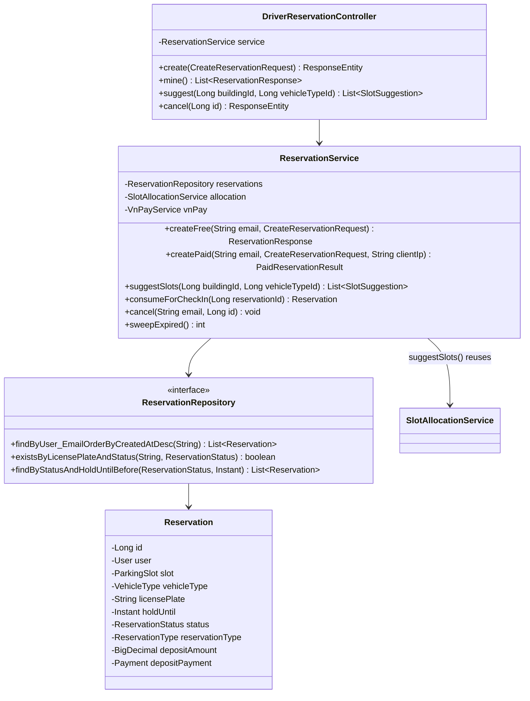
```mermaid
classDiagram
    class DriverReservationController {
        -ReservationService service
        +create(CreateReservationRequest) ResponseEntity
        +mine() List~ReservationResponse~
        +suggest(Long buildingId, Long vehicleTypeId) List~SlotSuggestion~
        +cancel(Long id) ResponseEntity
    }
    class ReservationService {
        -ReservationRepository reservations
        -SlotAllocationService allocation
        -VnPayService vnPay
        +createFree(String email, CreateReservationRequest) ReservationResponse
        +createPaid(String email, CreateReservationRequest, String clientIp) PaidReservationResult
        +suggestSlots(Long buildingId, Long vehicleTypeId) List~SlotSuggestion~
        +consumeForCheckIn(Long reservationId) Reservation
        +cancel(String email, Long id) void
        +sweepExpired() int
    }
    class Reservation {
        -Long id
        -User user
        -ParkingSlot slot
        -VehicleType vehicleType
        -String licensePlate
        -Instant holdUntil
        -ReservationStatus status
        -ReservationType reservationType
        -BigDecimal depositAmount
        -Payment depositPayment
    }
    class ReservationRepository {
        <<interface>>
        +findByUser_EmailOrderByCreatedAtDesc(String) List~Reservation~
        +existsByLicensePlateAndStatus(String, ReservationStatus) boolean
        +findByStatusAndHoldUntilBefore(ReservationStatus, Instant) List~Reservation~
    }
    DriverReservationController --> ReservationService
    ReservationService --> ReservationRepository
    ReservationService --> SlotAllocationService : suggestSlots() reuses
    ReservationRepository --> Reservation
```

### b. Class Specifications

#### ReservationService Class

| No | Method | Description |
| --- | --- | --- |
| 01 | `createFree` | Validates `reservedStart` window (future, ≤3h ahead) and no existing `PENDING` reservation for the plate, creates a `FREE` reservation with `holdUntil = reservedStart + 30min`. |
| 02 | `createPaid` | Locks the chosen slot (`RESERVED`), creates a `Payment` for the deposit (`ratePerHour`), builds a VNPay checkout URL via `VnPayService.buildPaymentUrl`. |
| 03 | `suggestSlots` | Delegates to `SlotAllocationService.rank` to return AI-ranked candidate slots for the driver to preview. |
| 04 | `consumeForCheckIn` | Marks a `PENDING` reservation `FULFILLED` at check-in time; rejects if expired or an unpaid deposit. |
| 05 | `sweepExpired` | Releases slots and marks reservations `EXPIRED` past `holdUntil`. |

### c. Sequence Diagram(s)

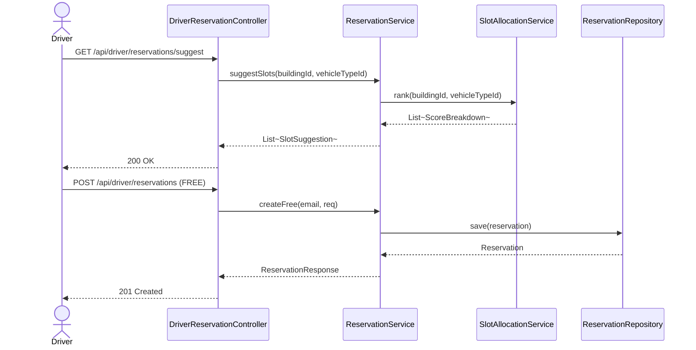
```mermaid
sequenceDiagram
    actor Driver
    participant DriverReservationController
    participant ReservationService
    participant SlotAllocationService
    participant ReservationRepository

    Driver->>DriverReservationController: GET /api/driver/reservations/suggest
    DriverReservationController->>ReservationService: suggestSlots(buildingId, vehicleTypeId)
    ReservationService->>SlotAllocationService: rank(buildingId, vehicleTypeId)
    SlotAllocationService-->>ReservationService: List~ScoreBreakdown~
    ReservationService-->>DriverReservationController: List~SlotSuggestion~
    DriverReservationController-->>Driver: 200 OK

    Driver->>DriverReservationController: POST /api/driver/reservations (FREE)
    DriverReservationController->>ReservationService: createFree(email, req)
    ReservationService->>ReservationRepository: save(reservation)
    ReservationRepository-->>ReservationService: Reservation
    ReservationService-->>DriverReservationController: ReservationResponse
    DriverReservationController-->>Driver: 201 Created
```

### d. Database Queries

```sql
-- ReservationService.createFree
SELECT EXISTS (SELECT 1 FROM reservation WHERE license_plate = ? AND status = 'PENDING');
INSERT INTO reservation
    (user_id, vehicle_type_id, license_plate, hold_until, status,
     reservation_type, reserved_start, building_id)
VALUES (?, ?, ?, ?, 'PENDING', 'FREE', ?, ?);

-- ReservationExpiryJob.sweepExpired
SELECT * FROM reservation WHERE status = 'PENDING' AND hold_until < now();
```

JPA derived queries: `ReservationRepository.findByUser_EmailOrderByCreatedAtDesc(String)`,
`ReservationRepository.existsByLicensePlateAndStatus(String, ReservationStatus)`,
`ReservationRepository.findByStatusAndHoldUntilBefore(ReservationStatus, Instant)`.

---

## 4. Pay for Session — CASH / ONLINE / VNPay (UC-22)

### a. Class Diagram

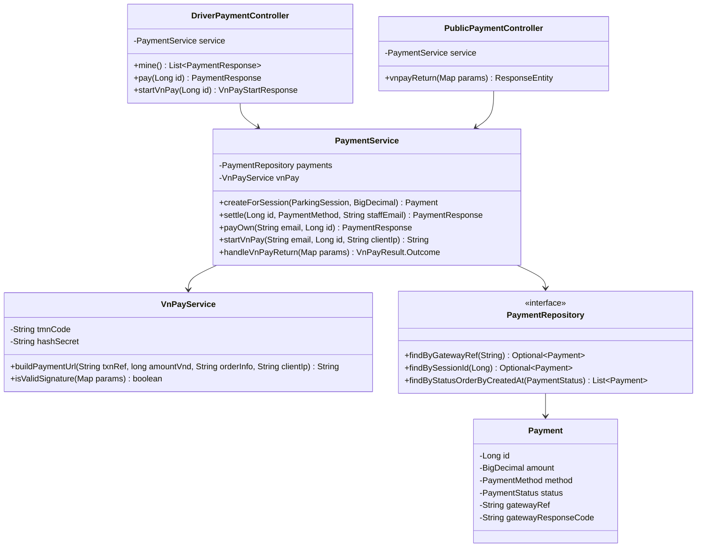
```mermaid
classDiagram
    class DriverPaymentController {
        -PaymentService service
        +mine() List~PaymentResponse~
        +pay(Long id) PaymentResponse
        +startVnPay(Long id) VnPayStartResponse
    }
    class PublicPaymentController {
        -PaymentService service
        +vnpayReturn(Map params) ResponseEntity
    }
    class PaymentService {
        -PaymentRepository payments
        -VnPayService vnPay
        +createForSession(ParkingSession, BigDecimal) Payment
        +settle(Long id, PaymentMethod, String staffEmail) PaymentResponse
        +payOwn(String email, Long id) PaymentResponse
        +startVnPay(String email, Long id, String clientIp) String
        +handleVnPayReturn(Map params) VnPayResult.Outcome
    }
    class VnPayService {
        -String tmnCode
        -String hashSecret
        +buildPaymentUrl(String txnRef, long amountVnd, String orderInfo, String clientIp) String
        +isValidSignature(Map params) boolean
    }
    class Payment {
        -Long id
        -BigDecimal amount
        -PaymentMethod method
        -PaymentStatus status
        -String gatewayRef
        -String gatewayResponseCode
    }
    class PaymentRepository {
        <<interface>>
        +findByGatewayRef(String) Optional~Payment~
        +findBySessionId(Long) Optional~Payment~
        +findByStatusOrderByCreatedAt(PaymentStatus) List~Payment~
    }
    DriverPaymentController --> PaymentService
    PublicPaymentController --> PaymentService
    PaymentService --> VnPayService
    PaymentService --> PaymentRepository
    PaymentRepository --> Payment
```

### b. Class Specifications

#### PaymentService Class

| No | Method | Description |
| --- | --- | --- |
| 01 | `startVnPay` | Resolves the driver's own `PENDING` payment, generates a unique `gatewayRef` (txnRef), persists it, asks `VnPayService.buildPaymentUrl` for the hosted-checkout URL. |
| 02 | `handleVnPayReturn` | Verifies `VnPayService.isValidSignature`, matches the payment by `gatewayRef`, checks response code `00` and amount match, sets `PAID` idempotently, then completes the linked session/pass/reservation. |
| 03 | `payOwn` | Driver-initiated mock online settle (no gateway round-trip) — sets `method = ONLINE`, `status = PAID`. |
| 04 | `settle` | Staff cash settlement — sets `method`, `status = PAID`, `processedByStaff`. |

#### VnPayService Class

| No | Method | Description |
| --- | --- | --- |
| 01 | `buildPaymentUrl` | Sorts params, builds `name=urlEncode(value)` hash data, signs with HMAC-SHA512 using the merchant hash secret, returns the full redirect URL. |
| 02 | `isValidSignature` | Recomputes the HMAC over all `vnp_*` params (excluding hash fields) and compares against `vnp_SecureHash`. |

### c. Sequence Diagram(s)

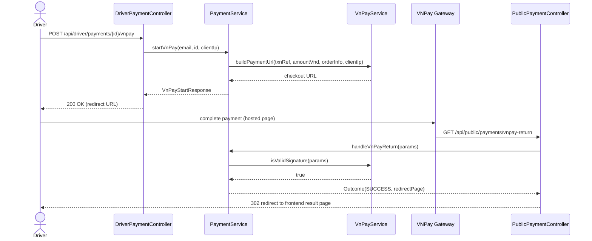
```mermaid
sequenceDiagram
    actor Driver
    participant DriverPaymentController
    participant PaymentService
    participant VnPayService
    participant VNPay as VNPay Gateway
    participant PublicPaymentController

    Driver->>DriverPaymentController: POST /api/driver/payments/{id}/vnpay
    DriverPaymentController->>PaymentService: startVnPay(email, id, clientIp)
    PaymentService->>VnPayService: buildPaymentUrl(txnRef, amountVnd, orderInfo, clientIp)
    VnPayService-->>PaymentService: checkout URL
    PaymentService-->>DriverPaymentController: VnPayStartResponse
    DriverPaymentController-->>Driver: 200 OK (redirect URL)

    Driver->>VNPay: complete payment (hosted page)
    VNPay->>PublicPaymentController: GET /api/public/payments/vnpay-return
    PublicPaymentController->>PaymentService: handleVnPayReturn(params)
    PaymentService->>VnPayService: isValidSignature(params)
    VnPayService-->>PaymentService: true
    PaymentService-->>PublicPaymentController: Outcome(SUCCESS, redirectPage)
    PublicPaymentController-->>Driver: 302 redirect to frontend result page
```

### d. Database Queries

```sql
-- PaymentService.startVnPay
SELECT * FROM payment WHERE id = ?;
UPDATE payment SET gateway_ref = ?, method = 'VNPAY' WHERE id = ?;

-- PaymentService.handleVnPayReturn
SELECT * FROM payment WHERE gateway_ref = ?;
UPDATE payment SET status = 'PAID', paid_at = now(),
    gateway_response_code = ?, gateway_txn_no = ? WHERE id = ?;
```

JPA derived queries: `PaymentRepository.findByGatewayRef(String)`,
`PaymentRepository.findBySessionId(Long)`,
`PaymentRepository.findByStatusOrderByCreatedAt(PaymentStatus)`.

---

## 5. AI Auto-Allocate Slot (UC-13, reused by UC-19)

Priority feature — answers RQ2–RQ4. Embedded in Check-In (UC-13 step 3) and
reused by Reserve a Slot's `suggest` endpoint (UC-19 step 2); not a standalone
UC, documented separately here per its weight in grading.

### a. Class Diagram

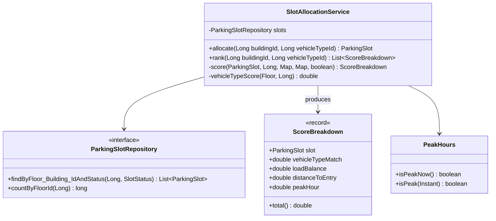
```mermaid
classDiagram
    class SlotAllocationService {
        -ParkingSlotRepository slots
        +allocate(Long buildingId, Long vehicleTypeId) ParkingSlot
        +rank(Long buildingId, Long vehicleTypeId) List~ScoreBreakdown~
        -score(ParkingSlot, Long, Map, Map, boolean) ScoreBreakdown
        -vehicleTypeScore(Floor, Long) double
    }
    class ScoreBreakdown {
        <<record>>
        +ParkingSlot slot
        +double vehicleTypeMatch
        +double loadBalance
        +double distanceToEntry
        +double peakHour
        +total() double
    }
    class ParkingSlotRepository {
        <<interface>>
        +findByFloor_Building_IdAndStatus(Long, SlotStatus) List~ParkingSlot~
        +countByFloorId(Long) long
    }
    class PeakHours {
        +isPeakNow() boolean
        +isPeak(Instant) boolean
    }
    SlotAllocationService --> ParkingSlotRepository
    SlotAllocationService --> ScoreBreakdown : produces
    SlotAllocationService --> PeakHours
```

### b. Class Specifications

#### SlotAllocationService Class

| No | Method | Description |
| --- | --- | --- |
| 01 | `rank` | Loads all `AVAILABLE` slots in the building, groups by floor to compute load-balance ratios, scores each slot, returns best-first. Score = `vehicleTypeMatch(40) + loadBalance(30) + distanceToEntry(20) + peakHour(10)`. |
| 02 | `allocate` | Convenience wrapper — returns just the top-ranked slot from `rank`, or throws 409 if none available. |
| 03 | `score` | Per-slot scoring: vehicle-type match is binary (40/0, or 20 for a mixed floor with no dedicated type); load balance is `availableRatio × 30`; distance is `20 / floor.level` (closer floors score higher); peak-hour bonus only applies during `PeakHours.isPeakNow()`. |

### c. Sequence Diagram(s)

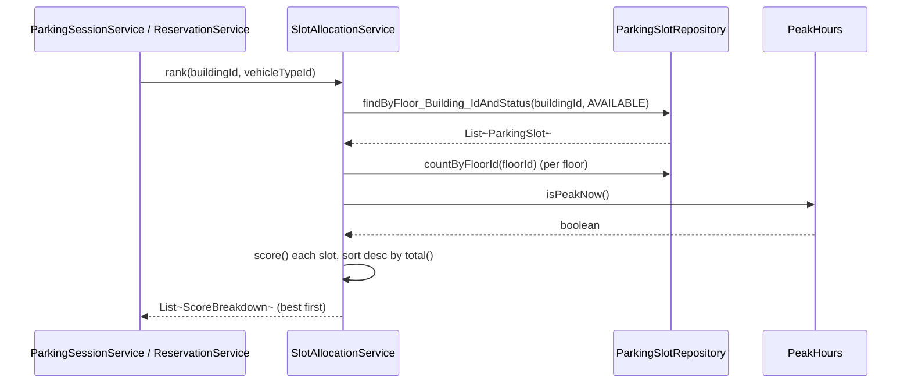
```mermaid
sequenceDiagram
    participant Caller as ParkingSessionService / ReservationService
    participant SlotAllocationService
    participant ParkingSlotRepository
    participant PeakHours

    Caller->>SlotAllocationService: rank(buildingId, vehicleTypeId)
    SlotAllocationService->>ParkingSlotRepository: findByFloor_Building_IdAndStatus(buildingId, AVAILABLE)
    ParkingSlotRepository-->>SlotAllocationService: List~ParkingSlot~
    SlotAllocationService->>ParkingSlotRepository: countByFloorId(floorId) (per floor)
    SlotAllocationService->>PeakHours: isPeakNow()
    PeakHours-->>SlotAllocationService: boolean
    SlotAllocationService->>SlotAllocationService: score() each slot, sort desc by total()
    SlotAllocationService-->>Caller: List~ScoreBreakdown~ (best first)
```

### d. Database Queries

```sql
-- SlotAllocationService.rank
SELECT ps.* FROM parking_slot ps
JOIN floor f ON f.id = ps.floor_id
WHERE f.building_id = ? AND ps.status = 'AVAILABLE';

SELECT COUNT(*) FROM parking_slot WHERE floor_id = ?;
```

JPA derived queries: `ParkingSlotRepository.findByFloor_Building_IdAndStatus(Long, SlotStatus)`,
`ParkingSlotRepository.countByFloorId(Long)`.

---

## 6. Monthly Pass — Issue / Use (UC-29, UC-32)

### a. Class Diagram

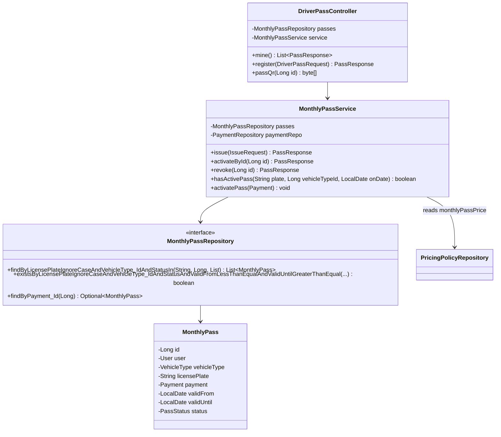
```mermaid
classDiagram
    class DriverPassController {
        -MonthlyPassRepository passes
        -MonthlyPassService service
        +mine() List~PassResponse~
        +register(DriverPassRequest) PassResponse
        +passQr(Long id) byte[]
    }
    class MonthlyPassService {
        -MonthlyPassRepository passes
        -PaymentRepository paymentRepo
        +issue(IssueRequest) PassResponse
        +activateById(Long id) PassResponse
        +revoke(Long id) PassResponse
        +hasActivePass(String plate, Long vehicleTypeId, LocalDate onDate) boolean
        +activatePass(Payment) void
    }
    class MonthlyPass {
        -Long id
        -User user
        -VehicleType vehicleType
        -String licensePlate
        -Payment payment
        -LocalDate validFrom
        -LocalDate validUntil
        -PassStatus status
    }
    class MonthlyPassRepository {
        <<interface>>
        +findByLicensePlateIgnoreCaseAndVehicleType_IdAndStatusIn(String, Long, List) List~MonthlyPass~
        +existsByLicensePlateIgnoreCaseAndVehicleType_IdAndStatusAndValidFromLessThanEqualAndValidUntilGreaterThanEqual(...) boolean
        +findByPayment_Id(Long) Optional~MonthlyPass~
    }
    DriverPassController --> MonthlyPassService
    MonthlyPassService --> MonthlyPassRepository
    MonthlyPassService --> PricingPolicyRepository : reads monthlyPassPrice
    MonthlyPassRepository --> MonthlyPass
```

### b. Class Specifications

#### MonthlyPassService Class

| No | Method | Description |
| --- | --- | --- |
| 01 | `issue` | Validates date range and no overlapping `ACTIVE`/`PENDING` pass for the same plate+vehicle type, reads `pricing_policy.monthly_pass_price`, creates the pass (`PENDING`) and a linked `Payment`. |
| 02 | `activatePass` | Called from `PaymentService` once the linked payment is `PAID` — flips a `PENDING` pass to `ACTIVE`. |
| 03 | `hasActivePass` | Used at checkout (UC-32, called from `ParkingSessionService.computeCharge`) — true if an `ACTIVE` pass for the plate+vehicle type covers `onDate`. |
| 04 | `revoke` | Manager action — sets `status = EXPIRED` regardless of current state. |

### c. Sequence Diagram(s)

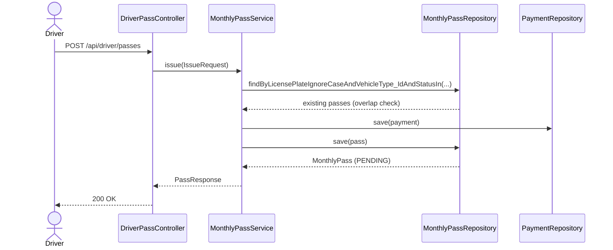
```mermaid
sequenceDiagram
    actor Driver
    participant DriverPassController
    participant MonthlyPassService
    participant MonthlyPassRepository
    participant PaymentRepository

    Driver->>DriverPassController: POST /api/driver/passes
    DriverPassController->>MonthlyPassService: issue(IssueRequest)
    MonthlyPassService->>MonthlyPassRepository: findByLicensePlateIgnoreCaseAndVehicleType_IdAndStatusIn(...)
    MonthlyPassRepository-->>MonthlyPassService: existing passes (overlap check)
    MonthlyPassService->>PaymentRepository: save(payment)
    MonthlyPassService->>MonthlyPassRepository: save(pass)
    MonthlyPassRepository-->>MonthlyPassService: MonthlyPass (PENDING)
    MonthlyPassService-->>DriverPassController: PassResponse
    DriverPassController-->>Driver: 200 OK
```

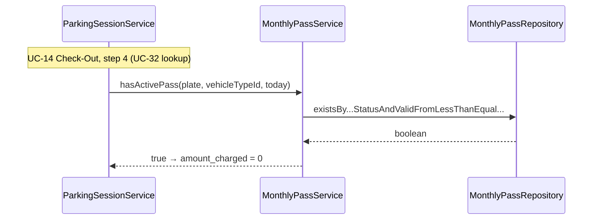
```mermaid
sequenceDiagram
    participant ParkingSessionService
    participant MonthlyPassService
    participant MonthlyPassRepository

    Note over ParkingSessionService: UC-14 Check-Out, step 4 (UC-32 lookup)
    ParkingSessionService->>MonthlyPassService: hasActivePass(plate, vehicleTypeId, today)
    MonthlyPassService->>MonthlyPassRepository: existsBy...StatusAndValidFromLessThanEqual...
    MonthlyPassRepository-->>MonthlyPassService: boolean
    MonthlyPassService-->>ParkingSessionService: true → amount_charged = 0
```

### d. Database Queries

```sql
-- MonthlyPassService.issue
SELECT * FROM monthly_pass
WHERE license_plate ILIKE ? AND vehicle_type_id = ? AND status IN ('ACTIVE','PENDING');
INSERT INTO payment (amount, method, status) VALUES (?, 'ONLINE', 'PENDING');
INSERT INTO monthly_pass
    (user_id, vehicle_type_id, license_plate, payment_id, valid_from, valid_until, status)
VALUES (?, ?, ?, ?, ?, ?, 'PENDING');

-- MonthlyPassService.hasActivePass (UC-32, checkout lookup)
SELECT EXISTS (
    SELECT 1 FROM monthly_pass
    WHERE license_plate ILIKE ? AND vehicle_type_id = ? AND status = 'ACTIVE'
      AND valid_from <= ? AND valid_until >= ?
);
```

JPA derived queries: `MonthlyPassRepository.findByLicensePlateIgnoreCaseAndVehicleType_IdAndStatusIn(String, Long, List<PassStatus>)`,
`MonthlyPassRepository.existsByLicensePlateIgnoreCaseAndVehicleType_IdAndStatusAndValidFromLessThanEqualAndValidUntilGreaterThanEqual(...)`,
`MonthlyPassRepository.findByPayment_Id(Long)`.

## 7. Manage Buildings / Floors / Slots (UC-5, UC-6, UC-7)

### a. Class Diagram

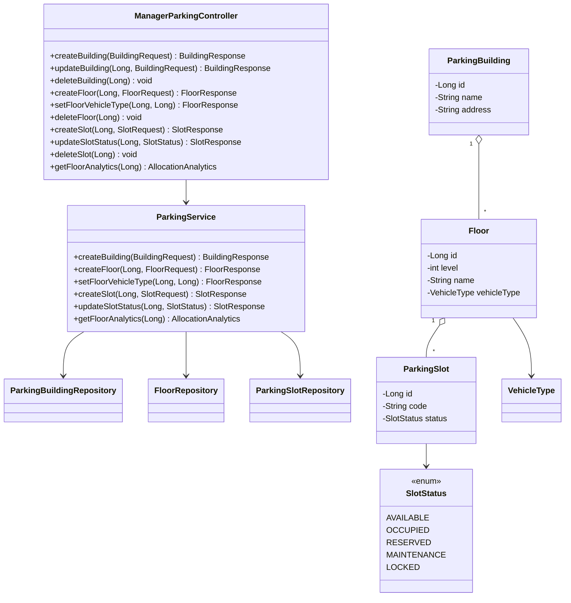
```mermaid
classDiagram
    class ManagerParkingController {
        +createBuilding(BuildingRequest) BuildingResponse
        +updateBuilding(Long, BuildingRequest) BuildingResponse
        +deleteBuilding(Long) void
        +createFloor(Long, FloorRequest) FloorResponse
        +setFloorVehicleType(Long, Long) FloorResponse
        +deleteFloor(Long) void
        +createSlot(Long, SlotRequest) SlotResponse
        +updateSlotStatus(Long, SlotStatus) SlotResponse
        +deleteSlot(Long) void
        +getFloorAnalytics(Long) AllocationAnalytics
    }
    class ParkingService {
        +createBuilding(BuildingRequest) BuildingResponse
        +createFloor(Long, FloorRequest) FloorResponse
        +setFloorVehicleType(Long, Long) FloorResponse
        +createSlot(Long, SlotRequest) SlotResponse
        +updateSlotStatus(Long, SlotStatus) SlotResponse
        +getFloorAnalytics(Long) AllocationAnalytics
    }
    class ParkingBuilding {
        -Long id
        -String name
        -String address
    }
    class Floor {
        -Long id
        -int level
        -String name
        -VehicleType vehicleType
    }
    class ParkingSlot {
        -Long id
        -String code
        -SlotStatus status
    }
    class SlotStatus {
        <<enum>>
        AVAILABLE
        OCCUPIED
        RESERVED
        MAINTENANCE
        LOCKED
    }
    ManagerParkingController --> ParkingService
    ParkingService --> ParkingBuildingRepository
    ParkingService --> FloorRepository
    ParkingService --> ParkingSlotRepository
    ParkingBuilding "1" o-- "*" Floor
    Floor "1" o-- "*" ParkingSlot
    Floor --> VehicleType
    ParkingSlot --> SlotStatus
```

### b. Class Specifications

| Class | Responsibility | Key members |
|---|---|---|
| `ManagerParkingController` | REST endpoints under `/api/manager` for building/floor/slot CRUD + per-building fill-rate analytics. | delegates all logic to `ParkingService`. |
| `ParkingService` | Transactional CRUD; enforces uniqueness (floor level per building, slot code per floor) and 404 guards. | `createBuilding/Floor/Slot`, `updateSlotStatus`, `setFloorVehicleType`, `getFloorAnalytics`. |
| `ParkingBuilding` / `Floor` / `ParkingSlot` | JPA entities (tables `parking_building`, `floor`, `parking_slot`). | `Floor.vehicleType` optional FK; `ParkingSlot.status` = `SlotStatus`. |
| `SlotStatus` | Slot lifecycle enum. | `AVAILABLE, OCCUPIED, RESERVED, MAINTENANCE, LOCKED`. |

### c. Sequence Diagram(s)

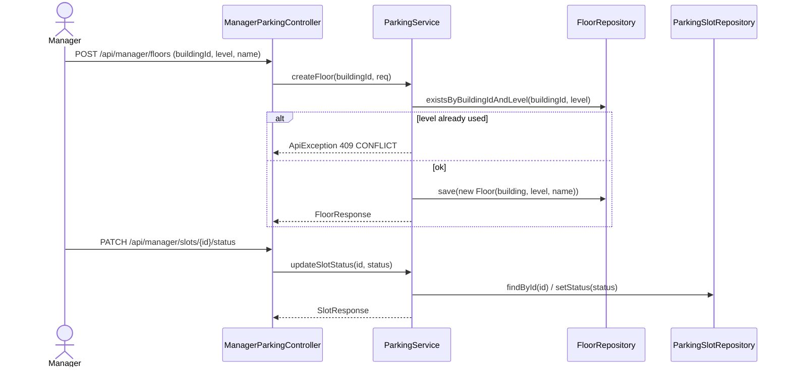
```mermaid
sequenceDiagram
    actor Manager
    participant C as ManagerParkingController
    participant S as ParkingService
    participant FR as FloorRepository
    participant SR as ParkingSlotRepository
    Manager->>C: POST /api/manager/floors (buildingId, level, name)
    C->>S: createFloor(buildingId, req)
    S->>FR: existsByBuildingIdAndLevel(buildingId, level)
    alt level already used
        S-->>C: ApiException 409 CONFLICT
    else ok
        S->>FR: save(new Floor(building, level, name))
        S-->>C: FloorResponse
    end
    Manager->>C: PATCH /api/manager/slots/{id}/status
    C->>S: updateSlotStatus(id, status)
    S->>SR: findById(id) / setStatus(status)
    S-->>C: SlotResponse
```

### d. Database Queries

```sql
-- ParkingService.createFloor guard (JPA: existsByBuildingIdAndLevel)
SELECT EXISTS(SELECT 1 FROM floor WHERE building_id = ? AND level = ?);

-- ParkingService.createSlot guard (JPA: existsByFloorIdAndCode)
SELECT EXISTS(SELECT 1 FROM parking_slot WHERE floor_id = ? AND code = ?);

-- ParkingService.getFloorAnalytics fill-rate (JPA: countByFloorIdAndStatus)
SELECT COUNT(*) FROM parking_slot WHERE floor_id = ? AND status = 'OCCUPIED';
```

JPA derived queries: `FloorRepository.findByBuildingIdOrderByLevel(Long)`,
`ParkingSlotRepository.findByFloorIdOrderByCode(Long)`,
`ParkingSlotRepository.countByFloorId(Long)`,
`ParkingSlotRepository.countByFloor_Building_Id(Long)`,
`ParkingSlotRepository.findByFloor_Building_IdAndStatus(Long, SlotStatus)`.

## 8. Manage Vehicle Types & Pricing Policy (UC-10, UC-11)

### a. Class Diagram

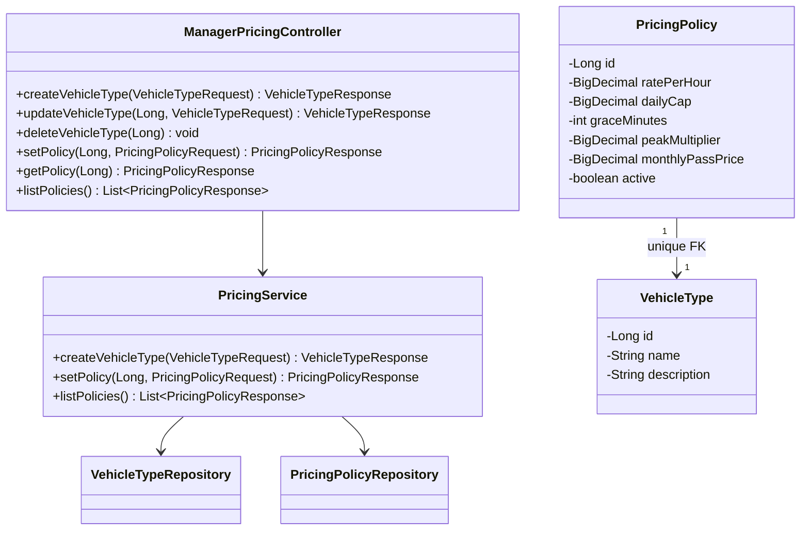
```mermaid
classDiagram
    class ManagerPricingController {
        +createVehicleType(VehicleTypeRequest) VehicleTypeResponse
        +updateVehicleType(Long, VehicleTypeRequest) VehicleTypeResponse
        +deleteVehicleType(Long) void
        +setPolicy(Long, PricingPolicyRequest) PricingPolicyResponse
        +getPolicy(Long) PricingPolicyResponse
        +listPolicies() List~PricingPolicyResponse~
    }
    class PricingService {
        +createVehicleType(VehicleTypeRequest) VehicleTypeResponse
        +setPolicy(Long, PricingPolicyRequest) PricingPolicyResponse
        +listPolicies() List~PricingPolicyResponse~
    }
    class VehicleType {
        -Long id
        -String name
        -String description
    }
    class PricingPolicy {
        -Long id
        -BigDecimal ratePerHour
        -BigDecimal dailyCap
        -int graceMinutes
        -BigDecimal peakMultiplier
        -BigDecimal monthlyPassPrice
        -boolean active
    }
    ManagerPricingController --> PricingService
    PricingService --> VehicleTypeRepository
    PricingService --> PricingPolicyRepository
    PricingPolicy "1" --> "1" VehicleType : unique FK
```

### b. Class Specifications

| Class | Responsibility | Key members |
|---|---|---|
| `ManagerPricingController` | `/api/manager/vehicle-types` + `/pricing` endpoints. | delegates to `PricingService`. |
| `PricingService` | Vehicle-type CRUD (unique name, case-insensitive) and **upsert** of the single pricing policy per type. | `createVehicleType`, `setPolicy` (find-or-create), `getPolicy`, `deletePolicy`. |
| `VehicleType` | Entity `vehicle_type`; unique `name`. | `name`, `description`. |
| `PricingPolicy` | Entity `pricing_policy`; one active policy per vehicle type (unique FK). | `ratePerHour`, `dailyCap`, `graceMinutes`, `peakMultiplier`, `monthlyPassPrice`. |

### c. Sequence Diagram(s)

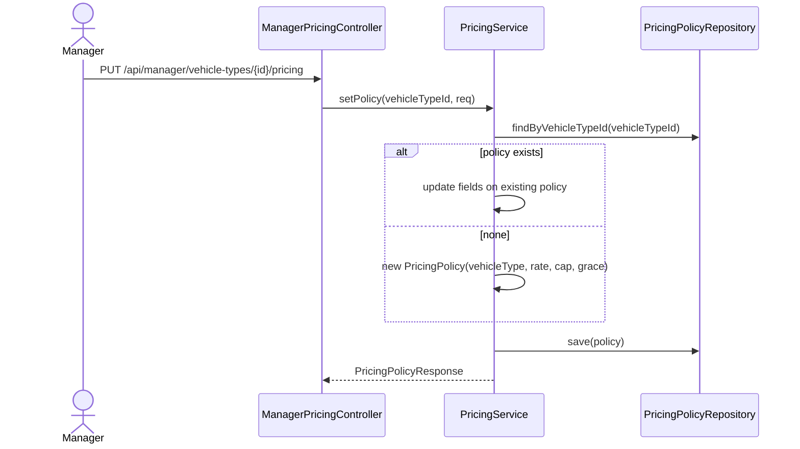
```mermaid
sequenceDiagram
    actor Manager
    participant C as ManagerPricingController
    participant S as PricingService
    participant PR as PricingPolicyRepository
    Manager->>C: PUT /api/manager/vehicle-types/{id}/pricing
    C->>S: setPolicy(vehicleTypeId, req)
    S->>PR: findByVehicleTypeId(vehicleTypeId)
    alt policy exists
        S->>S: update fields on existing policy
    else none
        S->>S: new PricingPolicy(vehicleType, rate, cap, grace)
    end
    S->>PR: save(policy)
    S-->>C: PricingPolicyResponse
```

### d. Database Queries

```sql
-- PricingService.createVehicleType guard (JPA: existsByNameIgnoreCase)
SELECT EXISTS(SELECT 1 FROM vehicle_type WHERE LOWER(name) = LOWER(?));

-- PricingService.setPolicy upsert lookup (JPA: findByVehicleTypeId)
SELECT * FROM pricing_policy WHERE vehicle_type_id = ?;

-- Insert when absent
INSERT INTO pricing_policy
    (vehicle_type_id, rate_per_hour, daily_cap, grace_minutes, peak_multiplier, monthly_pass_price, is_active)
VALUES (?, ?, ?, ?, ?, ?, TRUE);
```

JPA derived queries: `VehicleTypeRepository.findAllByOrderByName()`,
`PricingPolicyRepository.findByVehicleTypeId(Long)`,
`PricingPolicyRepository.findAllByOrderByVehicleTypeName()`.

## 9. Manage Users & Roles (UC-35, UC-36)

### a. Class Diagram

```mermaid
classDiagram
    class AdminUserController {
        +list() List~UserSummary~
        +create(CreateUserRequest) UserSummary
        +changeRole(Long, UpdateRoleRequest) UserSummary
        +setActive(Long, UpdateActiveRequest) UserSummary
    }
    class AdminUserService {
        +list() List~UserSummary~
        +create(CreateUserRequest) UserSummary
        +changeRole(Long, Role) UserSummary
        +setActive(Long, boolean) UserSummary
    }
    class User {
        -Long id
        -String email
        -String passwordHash
        -String fullName
        -Role role
        -boolean active
    }
    class Role {
        <<enum>>
        ADMIN
        MANAGER
        STAFF
        USER
    }
    AdminUserController --> AdminUserService
    AdminUserService --> UserRepository
    AdminUserService --> PasswordEncoder
    User --> Role
```

### b. Class Specifications

| Class | Responsibility | Key members |
|---|---|---|
| `AdminUserController` | `/api/admin/users` (ADMIN only). | list/create/changeRole/setActive. |
| `AdminUserService` | User admin; bcrypt-hashes new passwords, unique email guard. | `create` (encode password), `changeRole`, `setActive`. **No self-lockout guard** (an admin can demote/deactivate themselves — documented shortcut). |
| `User` | Entity `users`. | `email` (unique), `passwordHash`, `role`, `active`. |
| `Role` | Authority enum used in JWT + `SecurityConfig` prefixes. | `ADMIN, MANAGER, STAFF, USER`. |

### c. Sequence Diagram(s)

```mermaid
sequenceDiagram
    actor Admin
    participant C as AdminUserController
    participant S as AdminUserService
    participant UR as UserRepository
    participant PE as PasswordEncoder
    Admin->>C: POST /api/admin/users (email, password, role)
    C->>S: create(req)
    S->>UR: existsByEmail(email)
    alt email taken
        S-->>C: ApiException 409 CONFLICT
    else ok
        S->>PE: encode(password)
        S->>UR: save(new User(...))
        S-->>C: UserSummary
    end
    Admin->>C: PATCH /api/admin/users/{id}/role
    C->>S: changeRole(id, role)
    S->>UR: findById(id) / setRole(role)
    S-->>C: UserSummary
```

### d. Database Queries

```sql
-- AdminUserService.create guard (JPA: existsByEmail)
SELECT EXISTS(SELECT 1 FROM users WHERE email = ?);

-- create
INSERT INTO users (email, password_hash, full_name, role, is_active)
VALUES (?, ?, ?, ?, TRUE);

-- changeRole / setActive
UPDATE users SET role = ? WHERE id = ?;
UPDATE users SET is_active = ? WHERE id = ?;
```

JPA derived queries: `UserRepository.findAll()`, `UserRepository.existsByEmail(String)`,
`UserRepository.findByEmail(String)`.

## 10. Exception Reports — Report / Resolve (UC-26, UC-27, UC-28)

### a. Class Diagram

```mermaid
classDiagram
    class StaffExceptionController {
        +create(CreateExceptionRequest, Authentication) ExceptionResponse
        +open() List~ExceptionResponse~
        +get(Long) ExceptionResponse
    }
    class ManagerExceptionController {
        +all() List~ExceptionResponse~
        +open() List~ExceptionResponse~
        +resolve(Long, ResolveExceptionRequest) ExceptionResponse
    }
    class ExceptionReportService {
        +create(String, ExceptionType, String, Long) ExceptionResponse
        +listAll() List~ExceptionResponse~
        +listOpen() List~ExceptionResponse~
        +resolve(Long, String) ExceptionResponse
    }
    class ExceptionReport {
        -Long id
        -ExceptionType type
        -String description
        -ExceptionStatus status
        -String resolutionNote
        -Instant resolvedAt
    }
    class ExceptionType {
        <<enum>>
        LOST_TICKET
        WRONG_PLATE
        OVERTIME
        WRONG_ZONE
    }
    class ExceptionStatus {
        <<enum>>
        OPEN
        RESOLVED
    }
    StaffExceptionController --> ExceptionReportService
    ManagerExceptionController --> ExceptionReportService
    ExceptionReportService --> ExceptionReportRepository
    ExceptionReport --> ExceptionType
    ExceptionReport --> ExceptionStatus
    ExceptionReport --> ParkingSession : nullable
    ExceptionReport --> User : reportedBy
```

### b. Class Specifications

| Class | Responsibility | Key members |
|---|---|---|
| `StaffExceptionController` | `/api/staff/exceptions` — staff/driver raise + view open queue. | `create` (uses `Authentication.getName()`), `open`, `get`. |
| `ManagerExceptionController` | `/api/manager/exceptions` — full list + resolve. | `all`, `open`, `resolve`. |
| `ExceptionReportService` | Create (resolve reporter + optional session), list, resolve (blocks double-resolve). | `create`, `listOpen`, `resolve`. |
| `ExceptionReport` | Entity `exception_report`; `session` nullable (lost ticket may have none). | `type`, `status`, `resolutionNote`, `resolvedAt`. |

### c. Sequence Diagram(s)

```mermaid
sequenceDiagram
    actor Staff
    actor Manager
    participant SC as StaffExceptionController
    participant MC as ManagerExceptionController
    participant S as ExceptionReportService
    participant RR as ExceptionReportRepository
    Staff->>SC: POST /api/staff/exceptions (type, description, sessionId?)
    SC->>S: create(auth.name, type, description, sessionId)
    S->>RR: save(new ExceptionReport(reporter, type, desc, session))
    S-->>SC: ExceptionResponse (status OPEN)
    Manager->>MC: POST /api/manager/exceptions/{id}/resolve (note)
    MC->>S: resolve(id, note)
    alt already RESOLVED
        S-->>MC: ApiException 409 CONFLICT
    else
        S->>RR: setStatus(RESOLVED), setResolvedAt(now)
        S-->>MC: ExceptionResponse (status RESOLVED)
    end
```

### d. Database Queries

```sql
-- create
INSERT INTO exception_report (session_id, reported_by, type, description, status, created_at)
VALUES (?, ?, ?, ?, 'OPEN', ?);

-- listOpen (JPA: findByStatusOrderByCreatedAt)
SELECT * FROM exception_report WHERE status = 'OPEN' ORDER BY created_at;

-- resolve
UPDATE exception_report
   SET status = 'RESOLVED', resolution_note = ?, resolved_at = ?
 WHERE id = ?;
```

JPA derived queries: `ExceptionReportRepository.findAllByOrderByCreatedAtDesc()`,
`ExceptionReportRepository.findByStatusOrderByCreatedAt(ExceptionStatus)`.

## 11. Manager Analytics & Reports (UC-25, UC-37, UC-38, UC-39, UC-40)

### a. Class Diagram

```mermaid
classDiagram
    class ManagerReportController {
        +revenueDaily(Instant, Instant) DailyRevenueReport
        +revenueByVehicleType(Instant, Instant) RevenueByTypeReport
        +checkInsByHour(Instant, Instant) HourlyCheckInReport
        +durationByVehicleType(Instant, Instant) DurationByTypeReport
        +allocationComparison(Instant, Instant) AllocationComparison
    }
    class ReportService {
        +revenueDaily(Instant, Instant) DailyRevenueReport
        +checkInsByHour(Instant, Instant) HourlyCheckInReport
        +durationByVehicleType(Instant, Instant) DurationByTypeReport
        +allocationComparison(Instant, Instant) AllocationComparison
    }
    class PaymentService {
        +revenue(Instant, Instant) RevenueResponse
    }
    ManagerReportController --> ReportService
    ReportService --> PaymentRepository
    ReportService --> ParkingSessionRepository
    PaymentService --> PaymentRepository
```

### b. Class Specifications

| Class | Responsibility | Key members |
|---|---|---|
| `ManagerReportController` | `/api/manager/reports` — chart-ready analytics; every window is `[from, to)` UTC. | 5 GET endpoints. |
| `ReportService` | Aggregates payments + sessions in-memory into time-bucketed points. | `revenueDaily`, `checkInsByHour`, `durationByVehicleType`, `allocationComparison`. |
| `PaymentService.revenue` | Revenue summary (UC-25): total + count of PAID payments in window. | `revenue(from, to)`. |
| `AllocationComparison` (DTO) | Auto- vs manual-allocation avg session duration — **answers RQ2–RQ4**. | `autoCount`, `autoAvgMinutes`, `manualCount`, `manualAvgMinutes`. |

### c. Sequence Diagram(s)

```mermaid
sequenceDiagram
    actor Manager
    participant C as ManagerReportController
    participant S as ReportService
    participant SR as ParkingSessionRepository
    Manager->>C: GET /api/manager/reports/allocation-comparison?from&to
    C->>S: allocationComparison(from, to)
    S->>SR: startedIn(from, to)
    loop each checked-out session
        S->>S: bucket by isAutoAllocated(), sum minutes
    end
    S-->>C: AllocationComparison(auto vs manual avg)
```

### d. Database Queries

```sql
-- PaymentService.revenue (UC-25)
SELECT COALESCE(SUM(amount), 0) FROM payment WHERE status = 'PAID' AND paid_at >= ? AND paid_at < ?;
SELECT COUNT(*)                 FROM payment WHERE status = 'PAID' AND paid_at >= ? AND paid_at < ?;

-- ReportService.revenueDaily source rows (bucketed by day in service)
SELECT * FROM payment WHERE status = 'PAID' AND paid_at >= ? AND paid_at < ?;

-- ReportService.allocationComparison / duration / check-ins source rows
SELECT * FROM parking_session WHERE check_in_at >= ? AND check_in_at < ?;
```

JPA queries: `PaymentRepository.sumPaidBetween(Instant, Instant)`,
`PaymentRepository.countPaidBetween(Instant, Instant)`,
`PaymentRepository.paidBetween(Instant, Instant)`,
`ParkingSessionRepository.startedIn(Instant, Instant)`.
