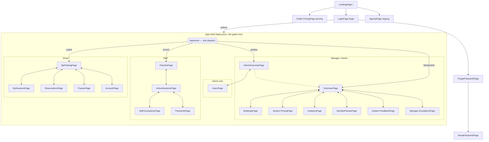
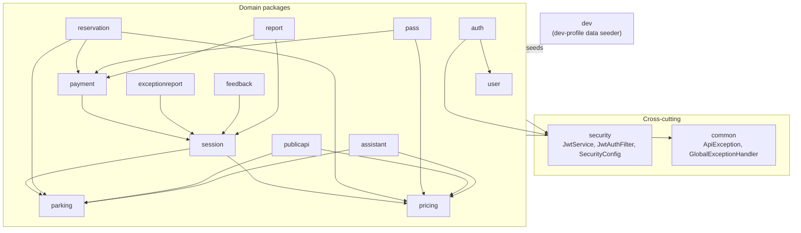

Software Requirement Specification

**ParkMaster — Parking Building Management System**

**Version: 1.0**

– FPT University, SWP391 –

---

# I. Overview

## 1. User Requirements

### 1.1 Actors

| # | Actor | Description |
| --- | --- | --- |
| 1 | `ADMIN` | Full system access: user management, role assignment, plus everything MANAGER and STAFF can do. |
| 2 | `MANAGER` | Building/floor/slot CRUD, pricing, monthly passes, feedback, exceptions, analytics/reports, plus everything STAFF can do. |
| 3 | `STAFF` | Check-in/check-out vehicles, settle/void payments, handle exception reports, look up sessions/passes. |
| 4 | `USER` (Driver) | Reserve slots, track own sessions, pay, manage own monthly passes, submit feedback, manage own profile. |
| 5 | Guest (no auth) | Browse landing page, public pricing, building/slot availability, use AI chat assistant, register/login. |
| 6 | VNPay (external) | Third-party payment gateway for `ONLINE`/VNPAY payment method; redirects back via `GET /api/public/payments/vnpay-return`. |
| 7 | Google Gemini (external) | Optional LLM backing the AI chat assistant (`POST /api/public/assistant/chat`); backend falls back to local FAQ if unconfigured/unreachable. |

### 1.2 Use Cases

#### a. Diagram(s)

```mermaid
flowchart LR
    Admin([ADMIN])
    Manager([MANAGER])
    Staff([STAFF])
    Driver([USER / Driver])
    Guest([Guest])
    VNPay([VNPay])
    Gemini([Google Gemini])

    UC1((Register))
    UC2((Login))
    UC3((Forgot Password))
    UC4((Reset Password))
    UC5((Manage Buildings))
    UC6((Manage Floors))
    UC7((Manage Slots))
    UC8((View Allocation Analytics))
    UC9((View Availability))
    UC10((Manage Vehicle Types))
    UC11((Manage Pricing Policy))
    UC12((View Public Pricing))
    UC13((Check-In Vehicle))
    UC14((Check-Out Vehicle))
    UC15((Look Up Session))
    UC16((View Active Sessions))
    UC17((View My Sessions))
    UC18((Estimate Charge))
    UC19((Reserve Slot))
    UC20((Cancel Reservation))
    UC21((View Reservation QR))
    UC22((Pay for Session))
    UC23((Settle/Void Payment))
    UC24((View Pending Payments))
    UC25((View Revenue Report))
    UC26((Report Exception))
    UC27((Resolve Exception))
    UC28((View Open Exceptions))
    UC29((Purchase Monthly Pass))
    UC30((Activate Pass))
    UC31((Revoke Pass))
    UC32((Look Up Pass at Checkout))
    UC33((Submit Feedback))
    UC34((View Feedback))
    UC35((Manage User Roles))
    UC36((Activate/Deactivate User))
    UC37((View Revenue Daily))
    UC38((View Check-ins by Hour))
    UC39((View Duration by Vehicle Type))
    UC40((View Allocation Comparison))
    UC41((Chat with AI Assistant))
    UC42((Manage Own Profile))

    Guest --> UC1
    Guest --> UC2
    Guest --> UC3
    Guest --> UC4
    Guest --> UC9
    Guest --> UC12
    Guest --> UC41

    Driver --> UC17
    Driver --> UC18
    Driver --> UC19
    Driver --> UC20
    Driver --> UC21
    Driver --> UC22
    Driver --> UC29
    Driver --> UC33
    Driver --> UC41
    Driver --> UC42

    Staff --> UC13
    Staff --> UC14
    Staff --> UC15
    Staff --> UC16
    Staff --> UC23
    Staff --> UC24
    Staff --> UC26
    Staff --> UC27
    Staff --> UC28
    Staff --> UC32

    Manager --> UC5
    Manager --> UC6
    Manager --> UC7
    Manager --> UC8
    Manager --> UC10
    Manager --> UC11
    Manager --> UC25
    Manager --> UC27
    Manager --> UC28
    Manager --> UC30
    Manager --> UC31
    Manager --> UC34
    Manager --> UC37
    Manager --> UC38
    Manager --> UC39
    Manager --> UC40

    Admin --> UC35
    Admin --> UC36

    UC22 --> VNPay
    UC29 --> VNPay
    UC41 --> Gemini
```

<!-- UC draft: redraw real UML if grader requires -->



> Admin inherits all Manager, Staff, and Driver use cases via role hierarchy
> (see `report-facts.md` §4) — omitted above for diagram readability.

#### b. Descriptions

| **ID** | **Feature** | **Use Case** | **Use Case Description** |
| --- | --- | --- | --- |
| UC-1 | Auth | Register | Driver self-registers with email/password. |
| UC-2 | Auth | Login | Any role logs in, receives JWT. |
| UC-3 | Auth | Forgot Password | Request password reset token by email. |
| UC-4 | Auth | Reset Password | Set new password using reset token. |
| UC-5 | Parking Mgmt | Manage Buildings | Manager creates/updates/deletes parking buildings. |
| UC-6 | Parking Mgmt | Manage Floors | Manager creates/deletes floors, assigns floor to a vehicle type. |
| UC-7 | Parking Mgmt | Manage Slots | Manager creates/deletes slots, updates slot status. |
| UC-8 | Parking Mgmt | View Allocation Analytics | Manager views per-building AI allocation analytics. |
| UC-9 | Parking Mgmt | View Building/Slot Availability | Guest/driver views live availability (public). |
| UC-10 | Pricing | Manage Vehicle Types | Manager creates/updates/deletes vehicle types. |
| UC-11 | Pricing | Manage Pricing Policy | Manager sets rate/hour, daily cap, grace period, peak multiplier per vehicle type. |
| UC-12 | Pricing | View Public Pricing | Guest views current pricing table. |
| UC-13 | Session | Check-In Vehicle | Staff checks in a vehicle; AI `SlotAllocationService` auto-allocates a slot. |
| UC-14 | Session | Check-Out Vehicle | Staff checks out a vehicle; `ChargeCalculator` computes amount due. |
| UC-15 | Session | Look Up Session | Staff looks up a session by plate or ticket code. |
| UC-16 | Session | View Active Sessions | Staff views all currently active sessions. |
| UC-17 | Session | View My Sessions | Driver views own session history/status. |
| UC-18 | Session | Estimate Charge | Driver previews current accrued charge for an active session. |
| UC-19 | Reservation | Reserve Slot | Driver reserves a slot (free or paid), with AI-suggested slot. |
| UC-20 | Reservation | Cancel Reservation | Driver cancels a pending reservation. |
| UC-21 | Reservation | View Reservation QR | Driver retrieves QR code for a reservation. |
| UC-22 | Payment | Pay for Session | Driver pays online or via VNPay. |
| UC-23 | Payment | Settle/Void Payment | Staff settles a cash payment or voids a payment. |
| UC-24 | Payment | View Pending Payments | Staff views payments awaiting settlement. |
| UC-25 | Payment | View Revenue Report | Manager views revenue summary. |
| UC-26 | Exception | Report Exception | Staff/driver reports lost ticket, wrong plate, overtime, or wrong zone. |
| UC-27 | Exception | Resolve Exception | Staff/manager resolves an open exception report. |
| UC-28 | Exception | View Open Exceptions | Staff/manager views the open-exception queue. |
| UC-29 | Monthly Pass | Purchase Monthly Pass | Driver purchases a monthly pass (paid via VNPay). |
| UC-30 | Monthly Pass | Activate Pass | Manager activates a pending pass. |
| UC-31 | Monthly Pass | Revoke Pass | Manager deletes/revokes a pass. |
| UC-32 | Monthly Pass | Look Up Pass at Checkout | Staff looks up an active pass by plate to zero out checkout charge. |
| UC-33 | Feedback | Submit Feedback | Driver rates/comments on a completed session. |
| UC-34 | Feedback | View Feedback | Manager views submitted feedback. |
| UC-35 | User Mgmt | Manage User Roles | Admin changes a user's role. |
| UC-36 | User Mgmt | Activate/Deactivate User | Admin enables/disables a user account. |
| UC-37 | Analytics | View Revenue (Daily) | Manager views daily revenue trend. |
| UC-38 | Analytics | View Check-ins by Hour | Manager views peak-hour check-in distribution. |
| UC-39 | Analytics | View Duration by Vehicle Type | Manager views average session duration per vehicle type. |
| UC-40 | Analytics | View Allocation Comparison | Manager compares AI auto-allocation vs free choice (answers RQ2–RQ4). |
| UC-41 | AI Assistant | Chat with AI Assistant | Guest/any user asks parking questions; answered via Gemini or local FAQ fallback. |
| UC-42 | Account | Manage Own Profile | Driver updates profile / changes password. |

## 2. Overall Functionalities

### 2.1 Screens Flow



> Pop-up/modal flows (e.g. reservation QR, ticket QR) are sub-views inside
> their owning screen, not separate routes — not drawn as distinct nodes.

### 2.2 Screen Descriptions

| **#** | **Feature** | **Screen** | **Description** |
| --- | --- | --- | --- |
| 1 | Public | LandingPage | Guest landing/marketing page (SEO). |
| 2 | Public | Public PricingPage | Guest-facing pricing table. |
| 3 | Auth | LoginPage | Login form. |
| 4 | Auth | SignUpPage | Driver registration form. |
| 5 | Auth | ForgotPasswordPage | Request password reset. |
| 6 | Auth | ResetPasswordPage | Set new password via token. |
| 7 | Staff | CheckInPage | Check-in vehicle (AI auto-allocate slot); also STAFF home. |
| 8 | Staff | ActiveSessionsPage | List/manage currently active sessions; check-out entry point. |
| 9 | Staff | Staff ExceptionsPage | Staff exception report queue. |
| 10 | Staff | PaymentsPage | Pending payments, settle/void. |
| 11 | Manager/Admin | BuildingsPage | Building/floor/slot CRUD. |
| 12 | Manager/Admin | System PricingPage | Vehicle type + pricing policy CRUD. |
| 13 | Admin | UsersPage | User list, role assignment, activate/deactivate. |
| 14 | Manager/Admin | AnalyticsPage | Revenue, check-in, duration, allocation-comparison charts. |
| 15 | Manager/Admin | MonthlyPassesPage | Monthly pass list, activate/revoke. |
| 16 | Manager/Admin | System FeedbackPage | Submitted driver feedback list. |
| 17 | Manager/Admin | Manager ExceptionsPage | Manager exception queue/resolve. |
| 18 | Manager | OverviewPage | MANAGER home dashboard. |
| 19 | Admin | AdminOverviewPage | ADMIN home dashboard. |
| 20 | Driver | MyParkingPage | USER home: current parking status. |
| 21 | Driver | MySessionsPage | Driver session history. |
| 22 | Driver | ReservationsPage | Reserve/cancel/view reservation QR. |
| 23 | Driver | PassesPage | Purchase/view own monthly passes. |
| 24 | Driver | AccountPage | Profile + change password. |

### 2.3 Screen Authorization

Enforced server-side by `SecurityConfig.java` role rules per `/api/{admin,manager,staff,driver,public}/**` prefix (`ADMIN` is a superset of `MANAGER`+`STAFF`+`USER`).

| **Screen** | **ADMIN** | **MANAGER** | **STAFF** | **USER** | **Guest** |
| --- | --- | --- | --- | --- | --- |
| LandingPage / Public PricingPage | | | | | X |
| Login / SignUp / Forgot / Reset Password | | | | | X |
| CheckInPage | X | X | X | | |
| ActiveSessionsPage | X | X | X | | |
| Staff ExceptionsPage | X | X | X | | |
| PaymentsPage | X | X | X | | |
| BuildingsPage | X | X | | | |
| System PricingPage | X | X | | | |
| UsersPage | X | | | | |
| AnalyticsPage | X | X | | | |
| MonthlyPassesPage | X | X | | | |
| System FeedbackPage | X | X | | | |
| Manager ExceptionsPage | X | X | | | |
| OverviewPage | X | X | | | |
| AdminOverviewPage | X | | | | |
| MyParkingPage | X | | | X | |
| MySessionsPage | X | | | X | |
| ReservationsPage | X | | | X | |
| PassesPage | X | | | X | |
| AccountPage | X | | | X | |

### 2.4 Non-UI Functions

| **#** | **Feature** | **System Function** | **Description** |
| --- | --- | --- | --- |
| 1 | Monitoring | `GET /api/public/health` | Health check; polled by UptimeRobot every 14 min to prevent Render spin-down. |
| 2 | Payment | `GET /api/public/payments/vnpay-return` | VNPay redirect/callback after gateway payment. |
| 3 | AI Assistant | `POST /api/public/assistant/chat` | Chat endpoint; calls Google Gemini server-side (JDK `HttpClient`), rate-limited per IP, falls back to local FAQ. |
| 4 | Dev Tooling | Dev seeder (`com.parkmaster.dev`) | Seeds 2 buildings, 6 floors, 86 slots, 5 active sessions, 30 days of historical data when `SPRING_PROFILES_ACTIVE=dev`. |
| 5 | Session | `SlotAllocationService` | Scores available slots (floor load, vehicle-type match, distance to entry, peak-hour factor) for AI auto-allocation at check-in/reservation. |
| 6 | Session | `ChargeCalculator` | Computes session charge with grace period and daily cap at check-out. |

## 3. System High Level Design

### 3.1 Database Design

#### a. Database Schema

Reused verbatim from `docs/erd/erd.md` (generated from Flyway `V1`–`V23`, cross-checked against JPA entities) — not regenerated here.

```mermaid
erDiagram
    USERS {
        BIGSERIAL id PK
        VARCHAR email UK
        VARCHAR password_hash
        VARCHAR full_name
        VARCHAR role
        BOOLEAN active
        TIMESTAMPTZ created_at
    }

    PARKING_BUILDING {
        BIGSERIAL id PK
        VARCHAR name
        VARCHAR address
        TIMESTAMPTZ created_at
    }

    FLOOR {
        BIGSERIAL id PK
        BIGINT building_id FK
        BIGINT vehicle_type_id FK
        INT level
        VARCHAR name
        TIMESTAMPTZ created_at
    }

    PARKING_SLOT {
        BIGSERIAL id PK
        BIGINT floor_id FK
        VARCHAR code
        VARCHAR status
        TIMESTAMPTZ created_at
    }

    VEHICLE_TYPE {
        BIGSERIAL id PK
        VARCHAR name UK
        VARCHAR description
        TIMESTAMPTZ created_at
    }

    PRICING_POLICY {
        BIGSERIAL id PK
        BIGINT vehicle_type_id FK_UK
        NUMERIC rate_per_hour
        NUMERIC daily_cap
        INT grace_minutes
        NUMERIC peak_multiplier
        NUMERIC monthly_pass_price
        BOOLEAN is_active
        TIMESTAMPTZ created_at
    }

    PARKING_SESSION {
        BIGSERIAL id PK
        BIGINT user_id FK
        BIGINT slot_id FK
        BIGINT vehicle_type_id FK
        VARCHAR license_plate
        VARCHAR ticket_code UK
        TIMESTAMPTZ check_in_at
        TIMESTAMPTZ check_out_at
        NUMERIC amount_charged
        VARCHAR status
        BOOLEAN auto_allocated
        JSONB allocation_score
        NUMERIC deposit_credit
        BOOLEAN from_reservation
        TIMESTAMPTZ created_at
    }

    PAYMENT {
        BIGSERIAL id PK
        BIGINT session_id FK_UK
        BIGINT processed_by_staff_id FK
        NUMERIC amount
        NUMERIC penalty_amount
        VARCHAR method
        VARCHAR status
        VARCHAR description
        VARCHAR gateway_ref UK
        VARCHAR gateway_txn_no
        VARCHAR gateway_response_code
        TIMESTAMPTZ created_at
        TIMESTAMPTZ paid_at
        TIMESTAMPTZ voided_at
        VARCHAR void_reason
    }

    RESERVATION {
        BIGSERIAL id PK
        BIGINT user_id FK
        BIGINT slot_id FK
        BIGINT vehicle_type_id FK
        BIGINT building_id FK
        BIGINT deposit_payment_id FK
        VARCHAR license_plate
        TIMESTAMPTZ hold_until
        TIMESTAMPTZ reserved_start
        VARCHAR reservation_type
        NUMERIC deposit_amount
        JSONB allocation_score
        TIMESTAMPTZ created_at
        VARCHAR status
    }

    EXCEPTION_REPORT {
        BIGSERIAL id PK
        BIGINT session_id FK
        BIGINT reported_by FK
        VARCHAR type
        TEXT description
        VARCHAR status
        TEXT resolution_note
        TIMESTAMPTZ created_at
        TIMESTAMPTZ resolved_at
    }

    MONTHLY_PASS {
        BIGSERIAL id PK
        BIGINT user_id FK
        BIGINT vehicle_type_id FK
        BIGINT payment_id FK
        VARCHAR license_plate
        DATE valid_from
        DATE valid_until
        VARCHAR status
        TIMESTAMPTZ created_at
    }

    FEEDBACK {
        BIGSERIAL id PK
        BIGINT session_id FK_UK
        BIGINT user_id FK
        SMALLINT rating
        VARCHAR comment
        TIMESTAMPTZ created_at
    }

    PASSWORD_RESET_TOKEN {
        BIGSERIAL id PK
        BIGINT user_id FK
        VARCHAR token UK
        TIMESTAMPTZ expires_at
        BOOLEAN used
        TIMESTAMPTZ created_at
    }

    PARKING_BUILDING ||--o{ FLOOR : contains
    VEHICLE_TYPE ||--o{ FLOOR : assigned_to
    FLOOR ||--o{ PARKING_SLOT : contains
    VEHICLE_TYPE ||--|| PRICING_POLICY : priced_by

    USERS ||--o{ PARKING_SESSION : owns
    PARKING_SLOT ||--o{ PARKING_SESSION : used_by
    VEHICLE_TYPE ||--o{ PARKING_SESSION : classifies
    PARKING_SESSION ||--o| PAYMENT : charged_by

    USERS ||--o{ PAYMENT : processes
    USERS ||--o{ RESERVATION : creates
    PARKING_SLOT ||--o{ RESERVATION : reserved_slot
    VEHICLE_TYPE ||--o{ RESERVATION : requested_type
    PARKING_BUILDING ||--o{ RESERVATION : requested_building
    PAYMENT ||--o{ RESERVATION : deposit_for

    PARKING_SESSION ||--o{ EXCEPTION_REPORT : has
    USERS ||--o{ EXCEPTION_REPORT : reports
    USERS ||--o{ MONTHLY_PASS : owns
    VEHICLE_TYPE ||--o{ MONTHLY_PASS : applies_to
    PAYMENT ||--o{ MONTHLY_PASS : pays_for
    PARKING_SESSION ||--o| FEEDBACK : receives
    USERS ||--o{ FEEDBACK : writes
    USERS ||--o{ PASSWORD_RESET_TOKEN : has
```

#### b. Table Descriptions

| **No** | **Table** | **Description** |
| --- | --- | --- |
| 01 | `users` | Account record for all roles (`ADMIN`/`MANAGER`/`STAFF`/`USER`).<br>- Primary key: `id`<br>- Foreign keys: none |
| 02 | `parking_building` | A physical parking building (site).<br>- Primary key: `id`<br>- Foreign keys: none |
| 03 | `floor` | A floor within a building, optionally dedicated to one vehicle type.<br>- Primary key: `id`<br>- Foreign keys: `building_id`→`parking_building`, `vehicle_type_id`→`vehicle_type` |
| 04 | `parking_slot` | A single parking spot on a floor; tracks `status` (`AVAILABLE`/`OCCUPIED`/`RESERVED`/`MAINTENANCE`/`LOCKED`).<br>- Primary key: `id`<br>- Foreign keys: `floor_id`→`floor` |
| 05 | `vehicle_type` | Vehicle category (e.g. motorbike, car).<br>- Primary key: `id`<br>- Foreign keys: none |
| 06 | `pricing_policy` | Rate/hour, daily cap, grace minutes, peak multiplier, monthly pass price per vehicle type.<br>- Primary key: `id`<br>- Foreign keys: `vehicle_type_id`→`vehicle_type` (unique) |
| 07 | `parking_session` | One park-in-to-park-out lifecycle; carries AI `allocation_score` (JSONB) when auto-allocated.<br>- Primary key: `id`<br>- Foreign keys: `user_id`→`users`, `slot_id`→`parking_slot`, `vehicle_type_id`→`vehicle_type` |
| 08 | `payment` | Charge/settlement record for a session or monthly pass (`CASH`/`ONLINE`/`VNPAY`).<br>- Primary key: `id`<br>- Foreign keys: `session_id`→`parking_session` (unique, nullable), `processed_by_staff_id`→`users` |
| 09 | `reservation` | Driver pre-booking by vehicle type + time window, with optional deposit and AI `allocation_score`.<br>- Primary key: `id`<br>- Foreign keys: `user_id`→`users`, `slot_id`→`parking_slot` (nullable), `vehicle_type_id`→`vehicle_type`, `building_id`→`parking_building` (nullable), `deposit_payment_id`→`payment` (nullable) |
| 10 | `exception_report` | Lost ticket / wrong plate / overtime / wrong zone report and resolution.<br>- Primary key: `id`<br>- Foreign keys: `session_id`→`parking_session` (nullable), `reported_by`→`users` |
| 11 | `monthly_pass` | Recurring access pass for a license plate + vehicle type, paid via `payment`.<br>- Primary key: `id`<br>- Foreign keys: `user_id`→`users`, `vehicle_type_id`→`vehicle_type`, `payment_id`→`payment` (nullable) |
| 12 | `feedback` | One rating + comment per completed session.<br>- Primary key: `id`<br>- Foreign keys: `session_id`→`parking_session` (unique), `user_id`→`users` |
| 13 | `password_reset_token` | One-time token for forgot/reset-password flow.<br>- Primary key: `id`<br>- Foreign keys: `user_id`→`users` |

Full enum values, indexes, and constraints: see `docs/erd/erd.md`.

### 3.2 Code Packages



***Package descriptions***

| **No** | **Package** | **Description** |
| --- | --- | --- |
| 01 | `assistant` | AI chat assistant controller/service (Gemini integration + local FAQ fallback). |
| 02 | `auth` | Register/login, JWT issuance, password reset. |
| 03 | `common` | `ApiException`, `GlobalExceptionHandler` (RFC7807 errors). |
| 04 | `dev` | Dev-profile data seeder. |
| 05 | `exceptionreport` | Exception report entity, staff/manager controllers, resolve flow. |
| 06 | `feedback` | Feedback entity, driver submit + manager view controllers. |
| 07 | `parking` | `ParkingBuilding`, `Floor`, `ParkingSlot` entities + manager CRUD controller. |
| 08 | `pass` | Monthly pass entity, driver purchase + manager activate/revoke controllers. |
| 09 | `payment` | `Payment` entity, driver/staff/manager/public controllers, VNPay integration. |
| 10 | `pricing` | `VehicleType`, `PricingPolicy` entities + manager controller. |
| 11 | `publicapi` | Public (no-auth) controller: health, availability, public pricing. |
| 12 | `report` | Manager analytics/report controller (revenue, check-ins, duration, allocation comparison). |
| 13 | `reservation` | `Reservation` entity, driver controller, AI slot suggestion. |
| 14 | `security` | `JwtService`, `JwtAuthFilter`, `SecurityConfig` (role-based `/api/**` routing). |
| 15 | `session` | `ParkingSession` entity, `ChargeCalculator`, `SlotAllocationService`, staff/driver controllers. |
| 16 | `user` | `User`, `Role`, repo, admin user-management controller, driver profile controller. |

**Naming convention:** each package follows `controller` (REST, role-prefixed e.g. `ManagerXController`/`StaffXController`/`DriverXController`/`PublicXController`) + `entity` (JPA `@Entity`) + `repository` (Spring Data JPA) + `service` (business logic, where the package needs one) inside the domain package itself — no separate top-level `controller`/`service`/`repository` packages.

# II. Requirement Specifications

Minimum representative set — one use case per core feature group. UC IDs and names per `report-facts.md` §2; not invented.

## 1. Authentication

### 1.1 UC-2_Login

#### a. Functional Description

| UC ID and Name: | **UC-2_Login** | | |
| --- | --- | --- | --- |
| Created By: | ParkMaster Dev Team | Date Created: | 2026-07-01 |
| Primary Actor: | ADMIN / MANAGER / STAFF / USER | Secondary Actors: | None |
| Trigger: | User submits the Login form (`LoginPage`) with email + password. | | |
| Description: | A registered user authenticates with email and password and receives a JWT access token, then is routed to the screen set for their role. | | |
| Preconditions: | PRE-1: User account exists in `users` and is `active = true`. | | |
| Postconditions: | POST-1: A signed JWT (role claim included) is returned and stored in `localStorage("accessToken")`. POST-2: User object is stored in `localStorage("user")`. | | |
| Normal Flow: | **2.0 Login**  1. User opens the Login page  2. User enters email and password, clicks Login  3. System (`POST /api/auth/login`) validates credentials against `users.password_hash` (BCrypt) (see 2.0.E1)  4. System issues a JWT with the user's role claim  5. Frontend stores token + user, routes to the role's landing page (`AppHome` dispatch in `App.jsx`) | | |
| Alternative Flows: | None | | |
| Exceptions: | **2.0.E1 Invalid credentials** — system returns 401, frontend shows inline error, user remains on Login page. **2.0.E2 Account inactive** — system returns 403 with a generic message. | | |
| Priority: | Must Have | | |
| Frequency of Use: | Every session (re-login after 15-minute inactivity logout). | | |
| Business Rules: | FR1 | | |
| Other Information: | Stateless JWT — no server-side session store; logout is client-side token removal. | | |
| Assumptions: | None | | |

#### b. Business Rules

| **ID** | **Business Rule** | **Business Rule Description** |
| --- | --- | --- |
| FR1 | Password Hashing | Passwords are stored as BCrypt hashes (`security` package); plaintext is never persisted or logged. |

## 2. Parking Session

### 2.1 UC-13_Check-In Vehicle

#### a. Functional Description

| UC ID and Name: | **UC-13_Check-In Vehicle** | | |
| --- | --- | --- | --- |
| Created By: | ParkMaster Dev Team | Date Created: | 2026-07-01 |
| Primary Actor: | STAFF | Secondary Actors: | System (AI `SlotAllocationService`) |
| Trigger: | A vehicle arrives at the gate; staff opens Check-In on `CheckInPage`. | | |
| Description: | Staff registers an arriving vehicle's plate and vehicle type; the system auto-allocates the best available slot (or accepts a manually chosen one) and opens a new `parking_session`. | | |
| Preconditions: | PRE-1: Staff is authenticated with role `STAFF`/`MANAGER`/`ADMIN`. PRE-2: At least one `AVAILABLE` slot exists for the requested vehicle type. | | |
| Postconditions: | POST-1: A `parking_session` row is created with `status = ACTIVE`, `check_in_at = now`. POST-2: The assigned `parking_slot.status` becomes `OCCUPIED`. POST-3: A ticket (`ticket_code` + QR) is issued. | | |
| Normal Flow: | **13.0 Check-In Vehicle**  1. Staff enters license plate and selects vehicle type  2. Staff submits (`POST /api/staff/sessions/check-in`)  3. System runs `SlotAllocationService` over all `AVAILABLE` slots matching the vehicle type, scoring each by vehicle-type match (40) + floor load balance (30) + distance to entry (20) + peak-hour factor (10) (see 13.0.E1)  4. System picks the highest-scoring slot, sets it `OCCUPIED`, persists the score in `allocation_score` (JSONB)  5. System creates the `parking_session` (`auto_allocated = true`) and returns the ticket  6. Staff hands the printed/QR ticket to the driver | | |
| Alternative Flows: | **13.1 Manual slot override** — staff picks a specific slot instead of the AI suggestion; `auto_allocated = false`, no `allocation_score` recorded. **13.2 Check-in from an existing reservation** — `from_reservation = true`, the pre-held slot is used directly, skipping step 3's scoring. | | |
| Exceptions: | **13.0.E1 No available slot for vehicle type** — system returns 409, staff is shown "no slot available" and may redirect the driver. | | |
| Priority: | Must Have | | |
| Frequency of Use: | Continuous, every vehicle arrival; concentrated at peak hours. | | |
| Business Rules: | FR1, FR2 | | |
| Other Information: | The allocation formula and its weighting directly answer **RQ2** (auto vs. manual time-to-park), **RQ3** (which criterion — vehicle match, load balance, distance, peak-hour — matters most), and **RQ4** (peak-hour utilization improvement); `allocation_score` is queryable for the manager analytics report (`ManagerReportController`) to evaluate these RQs. If slot-status persistence fails after scoring, the transaction rolls back and no session is created (no partial state). | | |
| Assumptions: | One active session per plate at a time (not separately enforced as a DB constraint; assumed by workflow). | | |

#### b. Business Rules

| **ID** | **Business Rule** | **Business Rule Description** |
| --- | --- | --- |
| FR1 | Slot Status Transition | A slot must be `AVAILABLE` to be allocated; on allocation it immediately becomes `OCCUPIED`. |
| FR2 | AI Scoring Weights | `SlotAllocationService` score = vehicleTypeMatch(40) + loadBalance(30) + distanceToEntry(20) + peakHour(10), max 100. |

### 2.2 UC-14_Check-Out Vehicle

#### a. Functional Description

| UC ID and Name: | **UC-14_Check-Out Vehicle** | | |
| --- | --- | --- | --- |
| Created By: | ParkMaster Dev Team | Date Created: | 2026-07-01 |
| Primary Actor: | STAFF | Secondary Actors: | None |
| Trigger: | Driver returns to the gate to leave; staff opens Check-Out and scans the ticket or looks up by plate. | | |
| Description: | Staff closes an active session, the system computes the charge (or zeroes it for an active monthly pass) and the slot is freed. | | |
| Preconditions: | PRE-1: A `parking_session` exists with `status = ACTIVE` for the given ticket/plate. | | |
| Postconditions: | POST-1: `parking_session.status = COMPLETED`, `check_out_at = now`, `amount_charged` set. POST-2: The slot's `status` returns to `AVAILABLE`. POST-3: A `payment` row is created in `PENDING` (cash/online) or auto-`PAID` (monthly pass covers it). | | |
| Normal Flow: | **14.0 Check-Out Vehicle**  1. Staff resolves the session via `GET /api/staff/sessions/by-ticket/{code}` or `by-plate`  2. Staff submits `POST /api/staff/sessions/{id}/check-out`  3. System runs `ChargeCalculator`: billed per started hour after a configurable grace window, capped at the vehicle type's daily cap (see 14.0.E1)  4. System checks for an active `monthly_pass` covering the plate + vehicle type; if found, charge is zeroed (see 14.1)  5. System sets the slot back to `AVAILABLE` and marks the session `COMPLETED`  6. System returns the final amount to staff for collection | | |
| Alternative Flows: | **14.1 Active monthly pass covers checkout** — step 4 finds a valid pass; `amount_charged = 0`, no `payment` collection step needed, session still logged as `COMPLETED`. | | |
| Exceptions: | **14.0.E1 Session not found / already closed** — system returns 404/409, staff is shown an error and may open an Exception Report (UC-34/UC-35/UC-36/UC-37) instead. | | |
| Priority: | Must Have | | |
| Frequency of Use: | Continuous, every vehicle departure. | | |
| Business Rules: | FR1, FR2 | | |
| Other Information: | `ChargeCalculator` is pure (no persistence dependency), unit-tested in isolation. If slot-release fails after charge is computed, the session remains `ACTIVE` and the operation is retried — charge is not double-applied since it is recomputed from `check_in_at`/`check_out_at`, not accumulated. | | |
| Assumptions: | None | | |

#### b. Business Rules

| **ID** | **Business Rule** | **Business Rule Description** |
| --- | --- | --- |
| FR1 | Grace + Daily Cap | Charge = hours billed (rounded up, after grace minutes) × `rate_per_hour`, capped at `daily_cap` per started day. |
| FR2 | Monthly Pass Override | An active `monthly_pass` matching plate + vehicle type zeroes the checkout charge. |

## 3. Reservation

### 3.1 UC-19_Reserve Slot

#### a. Functional Description

| UC ID and Name: | **UC-19_Reserve Slot** | | |
| --- | --- | --- | --- |
| Created By: | ParkMaster Dev Team | Date Created: | 2026-07-01 |
| Primary Actor: | USER (Driver) | Secondary Actors: | System (AI suggestion), VNPay (paid reservations) |
| Trigger: | Driver opens Reservation screen and wants to pre-book a slot before arriving. | | |
| Description: | Driver picks a building + vehicle type, optionally views AI-suggested slots, and creates a reservation — free (time-limited hold) or paid (deposit via VNPay, longer hold). | | |
| Preconditions: | PRE-1: Driver is authenticated. PRE-2: At least one slot of the requested vehicle type is `AVAILABLE` or becomes reservable via `suggest`. | | |
| Postconditions: | POST-1 (free): `reservation.status = PENDING`, target slot `status = RESERVED` until `hold_until`. POST-2 (paid): reservation created `PENDING` with an unpaid deposit `Payment`, a VNPay checkout URL is returned. | | |
| Normal Flow: | **19.0 Reserve Slot**  1. Driver selects building + vehicle type  2. Driver calls `GET /api/driver/reservations/suggest` to view AI-ranked candidate slots (reuses `SlotAllocationService`-style scoring)  3. Driver submits `POST /api/driver/reservations` with `reservationType = FREE`  4. System creates the reservation, holds the slot until `hold_until`, sets slot `RESERVED` (see 19.0.E1)  5. System returns the reservation confirmation + QR | | |
| Alternative Flows: | **19.1 Paid reservation** — `reservationType = PAID`: system computes `deposit_amount`, creates the reservation `PENDING_PAYMENT`, returns a VNPay checkout URL instead of an immediate hold; slot is held once VNPay confirms payment (see UC-29-style callback in `PublicPaymentController`). | | |
| Exceptions: | **19.0.E1 No slot available** — system returns 409; driver is told to retry later or pick a different building. | | |
| Priority: | Should Have | | |
| Frequency of Use: | Moderate — ahead of peak-hour arrivals. | | |
| Business Rules: | FR1 | | |
| Other Information: | Expired `PENDING` reservations (past `hold_until`) must release the slot back to `AVAILABLE` — implemented as a scheduled/lazy check, not a separate UC. | | |
| Assumptions: | One open reservation per driver per slot at a time. | | |

#### b. Business Rules

| **ID** | **Business Rule** | **Business Rule Description** |
| --- | --- | --- |
| FR1 | Hold Expiry | A `FREE` reservation's slot hold automatically lapses at `hold_until` if the driver does not check in. |

## 4. Payment

### 4.1 UC-22_Pay for Session

#### a. Functional Description

| UC ID and Name: | **UC-22_Pay for Session** | | |
| --- | --- | --- | --- |
| Created By: | ParkMaster Dev Team | Date Created: | 2026-07-01 |
| Primary Actor: | USER (Driver) | Secondary Actors: | STAFF (cash collection), VNPay |
| Trigger: | A `payment` row exists in `PENDING` status after checkout, or staff collects cash at the gate. | | |
| Description: | The owing amount for a completed session is settled — in person as cash (staff-recorded) or self-service online via VNPay. | | |
| Preconditions: | PRE-1: `payment.status = PENDING` exists, linked to a `COMPLETED` session. | | |
| Postconditions: | POST-1: `payment.status = PAID`, `paid_at` set. | | |
| Normal Flow: | **22.0 Pay for Session (Online)**  1. Driver opens My Payments, selects the pending payment  2. Driver calls `POST /api/driver/payments/{id}/vnpay` (or `/pay` to mark already-settled by another channel)  3. System builds a signed VNPay redirect URL with `gateway_ref`  4. Driver completes payment on VNPay's hosted page  5. VNPay redirects to `GET /api/public/payments/vnpay-return`; system verifies the signature and gateway response code (see 22.0.E1)  6. System sets `payment.status = PAID` and redirects the browser to the frontend result page | | |
| Alternative Flows: | **22.1 Cash payment** — staff collects cash at the gate and calls the staff payment endpoint directly; `method = CASH`, `processed_by_staff_id` set, `status = PAID` immediately, no VNPay round trip. | | |
| Exceptions: | **22.0.E1 Signature verification fails / gateway declines** — `payment.status` stays `PENDING` (or set to a failed marker), driver is redirected to a failure page and may retry. | | |
| Priority: | Must Have | | |
| Frequency of Use: | Every checkout that isn't covered by a monthly pass. | | |
| Business Rules: | FR1 | | |
| Other Information: | The VNPay callback (`PublicPaymentController`) is unauthenticated by necessity (VNPay/browser hits it directly) — security relies entirely on signature verification of `gateway_response_code`/`gateway_txn_no`, not JWT. | | |
| Assumptions: | None | | |

#### b. Business Rules

| **ID** | **Business Rule** | **Business Rule Description** |
| --- | --- | --- |
| FR1 | Signature Verification | A VNPay return is only honored if its signature matches the HMAC computed with the server's VNPay secret key. |

## 5. Monthly Pass

### 5.1 UC-29_Purchase Monthly Pass

#### a. Functional Description

| UC ID and Name: | **UC-29_Purchase Monthly Pass** | | |
| --- | --- | --- | --- |
| Created By: | ParkMaster Dev Team | Date Created: | 2026-07-01 |
| Primary Actor: | USER (Driver) | Secondary Actors: | VNPay |
| Trigger: | Driver opens the Monthly Pass screen and chooses to register a pass for a plate. | | |
| Description: | Driver registers a recurring pass for one license plate + vehicle type over a date range; once paid, the pass zeroes checkout charges for matching sessions (UC-32). | | |
| Preconditions: | PRE-1: Driver is authenticated. PRE-2: An active `pricing_policy.monthly_pass_price` exists for the vehicle type. | | |
| Postconditions: | POST-1: A `monthly_pass` row is created with `status = ACTIVE` once payment clears, `valid_from`/`valid_until` set. | | |
| Normal Flow: | **29.0 Purchase Monthly Pass**  1. Driver selects vehicle type, enters plate, picks `validFrom`/`validUntil`  2. Driver submits `POST /api/driver/passes`  3. System (`MonthlyPassService.issue`) creates the pass and a linked `payment` for `monthly_pass_price` (see 29.0.E1)  4. Driver pays the linked payment (reuses UC-22 online flow)  5. On `PAID`, system sets `monthly_pass.status = ACTIVE` | | |
| Alternative Flows: | None | | |
| Exceptions: | **29.0.E1 No pricing policy for vehicle type** — system returns 409, driver cannot register a pass for that vehicle type. | | |
| Priority: | Should Have | | |
| Frequency of Use: | Low — monthly per active commuter. | | |
| Business Rules: | FR1 | | |
| Other Information: | Pass usage at checkout is covered by **UC-32_Look Up Pass at Checkout** (staff/system look-up during UC-14 step 4), not duplicated here. A manager can also revoke a pass (`ManagerPassController`) outside this flow. | | |
| Assumptions: | One active pass per plate + vehicle type combination. | | |

#### b. Business Rules

| **ID** | **Business Rule** | **Business Rule Description** |
| --- | --- | --- |
| FR1 | Pass Activation Gating | A `monthly_pass` only becomes `ACTIVE` (usable at checkout) after its linked `payment.status = PAID`. |

# III. Design Specifications

## 1. Feature Designs

Detailed class diagrams, class specifications, sequence diagrams, and
database queries for each feature are **not duplicated here** — see
**SDS §II Code Designs** (`docs/report/SDS.md`), which covers Login,
Check-In/Check-Out, Reserve Slot, Pay for Session, Purchase Monthly Pass,
and AI Auto-Allocation with full class/sequence/SQL detail per use case
listed in §II above.

## 2. System Access

- **Authentication:** stateless JWT (Bearer token), issued by
  `POST /api/auth/login` (`auth` package + `security.JwtService`). No
  server-side session store — token validity is the sole authorization
  signal per request.
- **Authorization:** role-based route prefixes enforced by
  `security.SecurityConfig`:
  - `/api/admin/**` → `ADMIN`
  - `/api/manager/**` → `ADMIN`, `MANAGER`
  - `/api/staff/**` → `ADMIN`, `MANAGER`, `STAFF`
  - `/api/driver/**` → `ADMIN`, `USER`
  - `/api/public/**`, `/api/auth/**` → no authentication required
- **Token storage & transport:** frontend stores the JWT in
  `localStorage("accessToken")` and attaches it as
  `Authorization: Bearer <token>` on every request (`frontend/src/lib/api.js`).
- **Session expiry:** inactivity logout after 15 minutes on the frontend;
  the JWT itself carries its own server-side expiry claim.

# IV. Appendix

## 1. Assumptions & Dependencies

**Assumptions**

| # | Assumption |
| --- | --- |
| A1 | One active `parking_session` per license plate at a time — assumed by workflow (UC-13), not enforced as a DB constraint. |
| A2 | One open `reservation` per driver per slot at a time (UC-19). |
| A3 | One active `monthly_pass` per plate + vehicle-type combination (UC-29). |
| A4 | Expired `PENDING` reservations (past `hold_until`) are released back to `AVAILABLE` via a lazy/scheduled check, not a dedicated use case (UC-19). |

**Dependencies**

| # | Dependency | Purpose |
| --- | --- | --- |
| D1 | VNPay (external gateway) | `ONLINE`/`VNPAY` session payments and monthly-pass payment (UC-22, UC-29). |
| D2 | Google Gemini (external LLM, optional) | AI chat assistant; falls back to a local FAQ if unconfigured/unreachable (UC-41). |
| D3 | PostgreSQL (Neon in production) | System of record for all domain tables (§I.3.1). |
| D4 | UptimeRobot | External pinger on `GET /api/public/health` every 14 min to prevent Render free-tier spin-down. |

## 2. Limitations & Exclusions

| # | Limitation |
| --- | --- |
| L1 | No real-time push notifications — drivers must reload/poll screens (`MySessionsPage`, `PassesPage`) for status updates. |
| L2 | The one-active-session-per-plate, one-open-reservation-per-slot, and one-active-pass-per-plate rules (A1–A3) are application-level assumptions, not DB-level uniqueness constraints. |
| L3 | The AI chat assistant (UC-41) gives best-effort answers; accuracy is not guaranteed, especially in local-FAQ fallback mode. |
| L4 | The use-case diagram in §I.1.2 is a hand-drawn Mermaid `flowchart`, not formal UML use-case notation (see inline draft note). |

## 3. Business Rules

Consolidated from the per-use-case Business Rules tables in §II. IDs are
scoped per UC (e.g. `UC-13 FR1` ≠ `UC-14 FR1`); the UC column disambiguates.

| **UC** | **ID** | **Business Rule** | **Business Rule Description** |
| --- | --- | --- | --- |
| UC-2 | FR1 | Password Hashing | Passwords are stored as BCrypt hashes (`security` package); plaintext is never persisted or logged. |
| UC-13 | FR1 | Slot Status Transition | A slot must be `AVAILABLE` to be allocated; on allocation it immediately becomes `OCCUPIED`. |
| UC-13 | FR2 | AI Scoring Weights | `SlotAllocationService` score = vehicleTypeMatch(40) + loadBalance(30) + distanceToEntry(20) + peakHour(10), max 100. |
| UC-14 | FR1 | Grace + Daily Cap | Charge = hours billed (rounded up, after grace minutes) × `rate_per_hour`, capped at `daily_cap` per started day. |
| UC-14 | FR2 | Monthly Pass Override | An active `monthly_pass` matching plate + vehicle type zeroes the checkout charge. |
| UC-19 | FR1 | Hold Expiry | A `FREE` reservation's slot hold automatically lapses at `hold_until` if the driver does not check in. |
| UC-22 | FR1 | Signature Verification | A VNPay return is only honored if its signature matches the HMAC computed with the server's VNPay secret key. |
| UC-29 | FR1 | Pass Activation Gating | A `monthly_pass` only becomes `ACTIVE` (usable at checkout) after its linked `payment.status = PAID`. |
